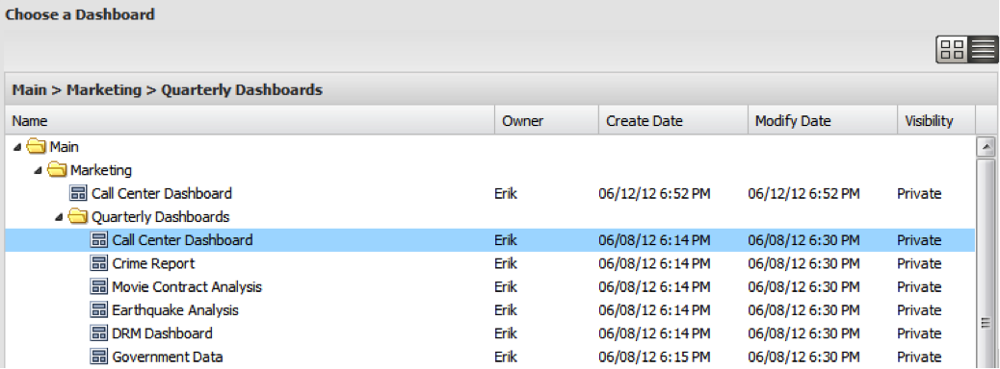

# ダッシュボードブラウザの表示{#dashboard-browser-views}

サムネールビューとリストビューについて説明します。

ダッシュボードブラウザ内でダッシュボードをナビゲートするために使用できるビューは2つあります。サムネールビューとリストビュー サムネールビューは、参照時にダッシュボードのサムネールを表示します。リストビューは、利用可能なダッシュボードの詳細なテーブルベースのビューです。

## Thumbnail View {#section-b522ce5e6e184ef9a0e1b9a42f7a9ae0}

サムネールビューには、アクセス権を持つダッシュボードに対応するサムネールのギャラリーが表示されます。 サムネールにデフォルトのアイコンが表示される場合は、管理者に問い合わせて、そのダッシュボードのサムネールを設定してください。 検索バーの左側のアイコンを使用して、サムネールビューとリストビューを切り替えることができます。

サムネールビューでは、ダッシュボードブラウザの左側のナビゲーションパネルに、ダッシュボードのストレージを整理したフォルダ階層が表示されます。 フォルダのコンテンツを表示するには、フォルダをクリックして、そのコンテンツをダッシュボードブラウザの中央のパネルにサムネールとして表示します。 フォルダーのそのレベルにダッシュボードが保存されていない場合は、ウィンドウの中央のパネルに「この場所にダッシュボードはありません」というメッセージが表示されます。

また、目的のフォルダの左にある矢印をクリックして、サブフォルダを表示することもできます。 選択したフォルダ内のサブフォルダとダッシュボードのリストが展開されます。 1つ以上のダッシュボードを含むフォルダを選択すると、中央のパネルに、その選択のレベルにある各ダッシュボードのサムネールが表示されます。 中央のパネルのタイトルも、選択したフォルダのパスを示すように変更されます。

その後、目的のダッシュボードをクリックして選択できます。 ダッシュボードのサムネールをクリックすると、右側のフレームにダッシュボードの詳細が表示されます。 ダッシュボードの詳細には、選択したダッシュボードのサムネールビュー、名前、簡単な説明、所有者、作成日、最終変更日、データのコンパイルに使用したプロファイル、表示コントロール、および選択した操作が含まれます。

## リスト表示{#section-aa79d51168a7430ea2816413dc6cc73a}

リストビューには、アクセス権を持つダッシュボードに関するテーブルベースの情報が表示されます。 リストビューの表の各行は、一意のダッシュボードを表します。 列見出しをクリックすると、その列でテーブルを降順または昇順に並べ替えることができます。

ダッシュボードのエントリをクリックすると、ダッシュボードの詳細がダッシュボードブラウザの右側のパネルに表示されます。 ビューを切り替えるには、目的のビューオプションを再度選択します。
