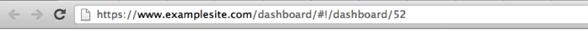

# ダッシュボードハイパーリンク{#dashboard-hyperlink}

ダッシュボードを開く3つ目の方法は、ダッシュボードのハイパーリンクを使用する方法です。

各ダッシュボードには、ブラウザーのアドレスバーからダッシュボードを開くために使用できる、固有のハイパーリンクがあります。 ダッシュボードのハイパーリンクは、電子メールでブックマークや共有を行う場合にも使用できます。

ダッシュボードのハイパーリンクがある場合は、ブラウザーのアドレスバーにハイパーリンクを入力し、そのリンクに移動します。 ダッシュボードサイトに移動し、ログインするように求められます（まだログインしていない場合）。 ログインすると、ダッシュボードがインターフェイスに読み込まれます。

>[!NOTE]
>
>ダッシュボードが存在しなくなった場合、またはダッシュボードにアクセスするための適切な権限を持っていない場合は、メッセージが表示されます。

