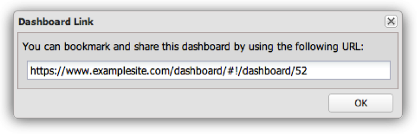
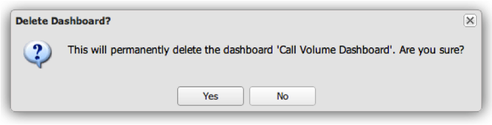

# その他のダッシュボード機能{#other-dashboard-functions}

特別な機能には、ダッシュボードの共有、書き出し、削除などがあり、選択したダッシュボードの詳細パネルから実行できます。

## Sharing a Dashboard Hyperlink {#section-16b592f157de404fb25bd2c739d2e2c1}

この操 **[!UICONTROL Share]** 作は、ダッシュボードをブックマークするために使用するURL、または他のユーザーがダッシュボードにアクセスするためのリンクをメールで送信するためのURLを提供します。 [ダッシュボードリンク]ウィンドウが開き、目的のダッシュボードへのリンクを共有するのに必要な情報が表示されます。

>[!NOTE]
>
>リンクの受信者も、ダッシュボードを表示するには、ダッシュボードにアクセスできる必要があります。

## ダッシュボードデータのエクスポート {#section-ace2f5f8807548ee8436f5c1dc2cd9d2}

この操 **[!UICONTROL Export Data]** 作により、選択したダッシュボードのエクスポートが開始され、ExcelまたはCSV（コンマ区切り値）ファイルとして保存されます。

## ダッシュボードの削除 {#section-adc10cb1b3174ff699c024ddc8f994fa}

この操作 **[!UICONTROL Delete]** により、ダッシュボードが削除されます。 ダッシュボードを削除するには、そのユーザがダッシュボードの所有者であるか、管理者アクセス権を持っている必要があります。 [削除]操作をクリックすると、ダッシュボードを削除することを確認するウィンドウが表示されます。

