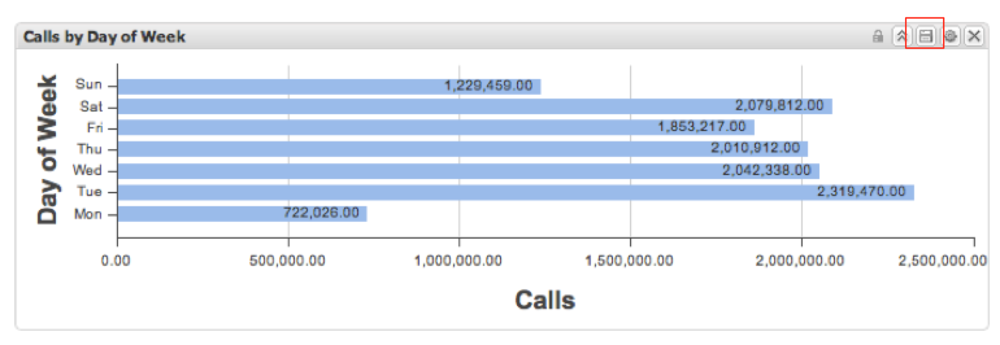
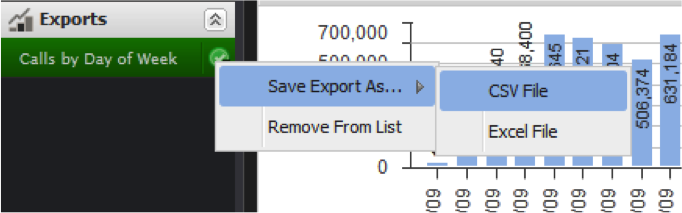
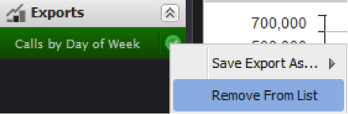

# データのエクスポート{#exporting-data}

{{eol}}

データをエクスポートする 3 つの方法と、エクスポートを取得する方法を示します。

データは、3 つの方法でダッシュボードからエクスポートできます。

まず、個々のビジュアライゼーションからデータを書き出すことができます。 次に、行った設定や選択内容を含め、現在の作業用ダッシュボードを書き出します。 3 つ目は、保存したダッシュボードを開かずに書き出す方法です。

書き出しは、2 つの手順で実行します。 まず、上記の 3 つの方法のいずれかを使用して、エクスポートがサーバー上のキューに格納されます。 エクスポートのステータスが **[!UICONTROL Exports]** メニューを開きます。 次に、エクスポートの準備が整ったら、データを CSV 形式または Excel 形式でダウンロードできます。

エクスポートには数分かかる場合がありますが、エクスポート中も引き続きアプリケーションを使用できます。

## ビジュアライゼーションのエクスポート {#section-46b74b46c2eb44129c8b85a9eabd2304}

ビジュアライゼーションからデータをエクスポートするには、 **[!UICONTROL Save]** （ビジュアライゼーションのツールメニュー）。

サーバーでエクスポートが開始され、エクスポートインジケータがエクスポートメニューに追加されます。

## ダッシュボードの書き出し {#section-27329f2a5fed44b49deb26dc5164531f}

作業用ダッシュボードからデータのエクスポートを開始するには、「 」を選択します。 **[!UICONTROL Export]** から **[!UICONTROL Dashboard]** メニュー

サーバーでエクスポートが開始され、エクスポートインジケータがエクスポートメニューに追加されます。

## 保存済みダッシュボードの書き出し {#section-e989f7b16e25479ab77454f2c34471ba}

保存したダッシュボードからデータのエクスポートを開始するには、ダッシュボードブラウザを使用します。 ダッシュボードブラウザー内で目的のダッシュボードを参照し、選択してダッシュボードの詳細を表示します。 右側の詳細パネルで、 **[!UICONTROL Operations]** セクション、選択 **[!UICONTROL Export Data]**.

サーバーでエクスポートが開始され、エクスポートインジケーターが **[!UICONTROL Exports]** メニュー。

## 書き出しを取得中 {#section-0f03c5321c804867b7c72cf92f6f67d0}

エクスポートが完了すると、エクスポートの準備ができたことを通知するポップアップ通知が表示されます。

エクスポートを取得するには、 **[!UICONTROL Exports]** メニュー 目的のエクスポートの項目の右側にある緑のチェックマークをクリックすると、ドロップダウンメニューが表示されます。 このメニュー内の **[!UICONTROL Save Export As…]** サブメニューで、適切なメニューオプションを選択して、CSV 形式または Excel 形式でのエクスポートをダウンロードします。

これで、ブラウザーのファイルのダウンロード処理が開始します。

エクスポートは自動的には削除されないので、各形式のエクスポートを簡単にダウンロードできます。 エクスポートを **[!UICONTROL Exports]** メニューを使用して、 それ以外の場合は、ログアウト時に自動的に削除されます。

エクスポートを **[!UICONTROL Export List]**&#x200B;をクリックし、書き出しタイトルの右側のチェックマークをクリックして、「 」を選択します。 **[!UICONTROL Remove From List]**.

