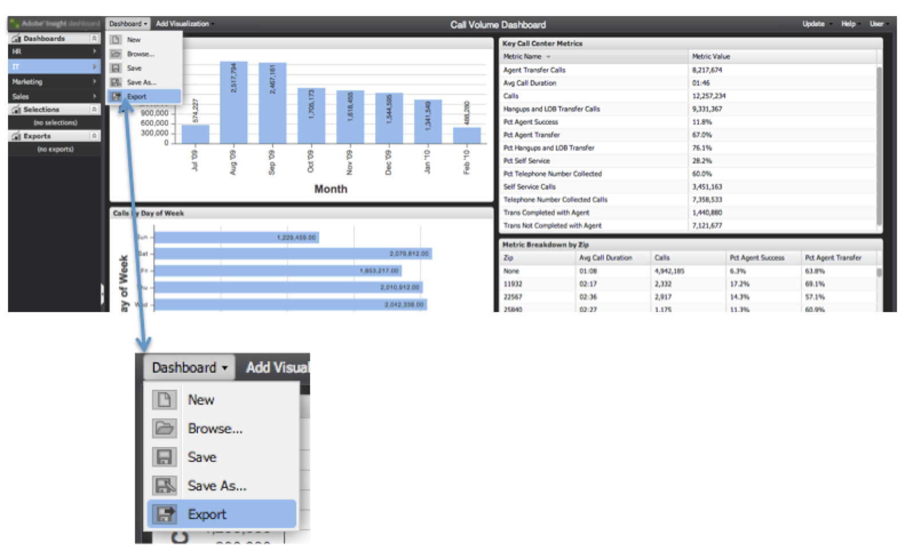

# データの書き出し {#exporting-data}

{{eol}}

データを書き出す 3 つの方法と、書き出しを取得する方法を示します。

データは、3 つの方法でダッシュボードから書き出すことができます。

最初の方法では、個々のビジュアライゼーションからデータを書き出すことができます。2 番目の方法では、現在作業中のダッシュボードを、これまでに行った設定や選択内容を含めて書き出すことができます。3 番目の方法では、保存したダッシュボードは開かなくても書き出すことができます。

書き出しは、2 段階のプロセスを使用して実行します。最初に、上記の 3 つの方法のいずれかを使用して、書き出しをサーバー上のキューに格納します。書き出しの準備中、書き出しのステータスが&#x200B;**[!UICONTROL 書き出し]**&#x200B;メニューに表示されます。次に、書き出しの準備が整ったら、データを CSV 形式または Excel 形式でダウンロードできます。

書き出しには数分かかる場合がありますが、書き出し中も引き続きアプリケーションを使用できます。

## ビジュアライゼーションの書き出し {#section-46b74b46c2eb44129c8b85a9eabd2304}

ビジュアライゼーションからデータを書き出すには、ビジュアライゼーションのツールメニューで「**[!UICONTROL 保存]**」をクリックします。

書き出しはサーバー上で開始され、書き出しインジケーターが書き出しメニューに追加されます。

## ダッシュボードの書き出し {#section-27329f2a5fed44b49deb26dc5164531f}

作業中のダッシュボードからデータの書き出しを開始するには、**[!UICONTROL ダッシュボード]**&#x200B;メニューから「**[!UICONTROL 書き出し]**」を選択します。

書き出しはサーバー上で開始され、書き出しインジケーターが書き出しメニューに追加されます。

## 保存したダッシュボードの書き出し {#section-e989f7b16e25479ab77454f2c34471ba}

保存したダッシュボードからデータの書き出しを開始するには、ダッシュボードブラウザーを使用します。ダッシュボードブラウザー内で、目的のダッシュボードを参照して選択します。ダッシュボードの詳細が表示されます。右側の詳細パネルの「**[!UICONTROL 操作]**」セクションで、「**[!UICONTROL データの書き出し]**」を選択します。

書き出しはサーバー上で開始され、書き出しインジケーターが **[!UICONTROL 書き出し]** メニューに追加されます
。

## 書き出しの取得 {#section-0f03c5321c804867b7c72cf92f6f67d0}

書き出しが完了すると、書き出しの準備が整ったことを通知するポップアップ通知が表示されます。

書き出しを取得するには、**[!UICONTROL 書き出し]**&#x200B;メニューを使用します。目的の書き出し項目の右側にある緑色のチェックマークをクリックすると、ドロップダウンメニューが表示されます。このメニュー内の&#x200B;**[!UICONTROL 書き出しに名前を付けて保存…]**&#x200B;サブメニューで、適切なメニューオプションを選択して、CSV 形式または Excel 形式で書き出しをダウンロードします。

ブラウザーのファイルダウンロードプロセスが開始されます。

書き出しは自動的に削除されないので、各形式で簡単にダウンロードできます。左側のナビゲーションパネルの&#x200B;**[!UICONTROL 書き出し]**&#x200B;メニューから書き出しを削除できます。それ以外の場合は、ログアウト時に自動的に削除されます。

書き出しを&#x200B;**[!UICONTROL 書き出しリスト]**&#x200B;から削除するには、書き出しタイトルの右側にあるチェックマークをクリックし、「**[!UICONTROL リストから削除]**」を選択します。

