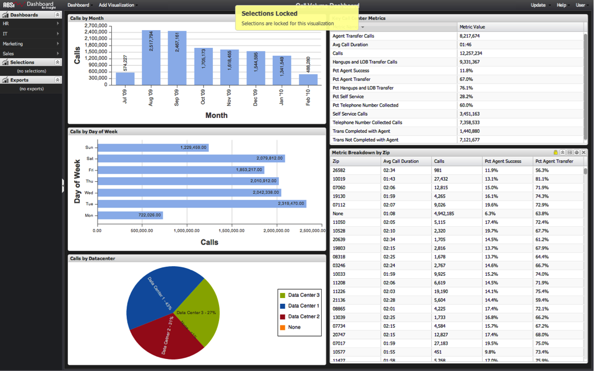

# ロックされた選択項目{#locked-selections}

ダッシュボード上の1つ以上のビジュアライゼーション内の選択範囲をロックして、現在の選択範囲を保持し、それ以上の変更を防ぐことができます。

ビジュアライゼーションをロックすると、特定の項目を事前に選択して、ダッシュボード全体に永久的に適用できるので、分析のガイドに役立ちます。 これにより、変更を許可せずに、フィルターの適用対象を画面上で視覚的に示すインジケータが表示されます。

ロックは、ダッシュボードが達成を目指す分析に関連するビジュアライゼーションのみを選択できるので、分析のガイドにも役立ちます。 例えば、以下のサンプルダッシュボードでは、郵便番号レベルまでドリルダウンすると、高レベルの通話量分析の範囲を超える場合があります。 この場合、**[!UICONTROL Metric Breakdown by Zip]**&#x200B;テーブルをロックして、月、曜日、データセンターのビジュアライゼーションでのみ選択できるので、意味があります。

ロックされたビジュアライゼーションを選択しようとすると、ビジュアライゼーションがロックされていることを示すメッセージが表示されます。 ロックされたビジュアライゼーションの上にマウスカーソルを置くと、ビジュアライゼーションヘッダーに金色の錠前のアイコンも表示されます。

他の選択と同様に、ロックされた選択は、ダッシュボードの保存時に保持され、ダッシュボードの読み込み時にはアクティブなままになります。 詳しくは、[ビジュアライゼーションのロックとロック解除](../../../home/c-adobe-data-workbench-dashboard/c-visualizations/c-manipulating-visualizations/c-locking-and-unlocking-visualizations.md#concept-9215bcdd5bb44dee8d92ef0cc82f44d2)を参照してください。
