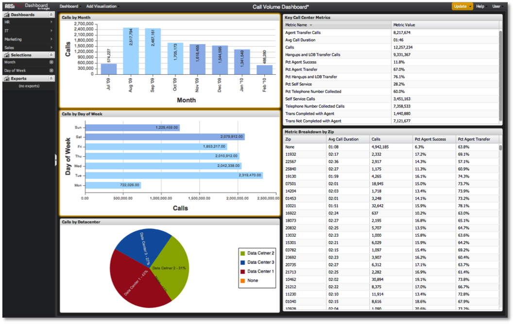

# 選択項目の適用{#applying-selections}

{{eol}}

選択内容は、ダッシュボードのデータ結果に自動的には適用されません。

1. 目的の選択を完了し、「 **[!UICONTROL Update]**.

   この **[!UICONTROL Update]** ボタンがオレンジ色に表示されます。これは、ダッシュボードの選択に変更を適用するには、このボタンをクリックする必要があることを示します。 この機能を使用すると、変更を加えるたびにクエリを開始することなく、画面上で複数の選択を行い、分析に関する質問を枠で囲むことができます。

   
