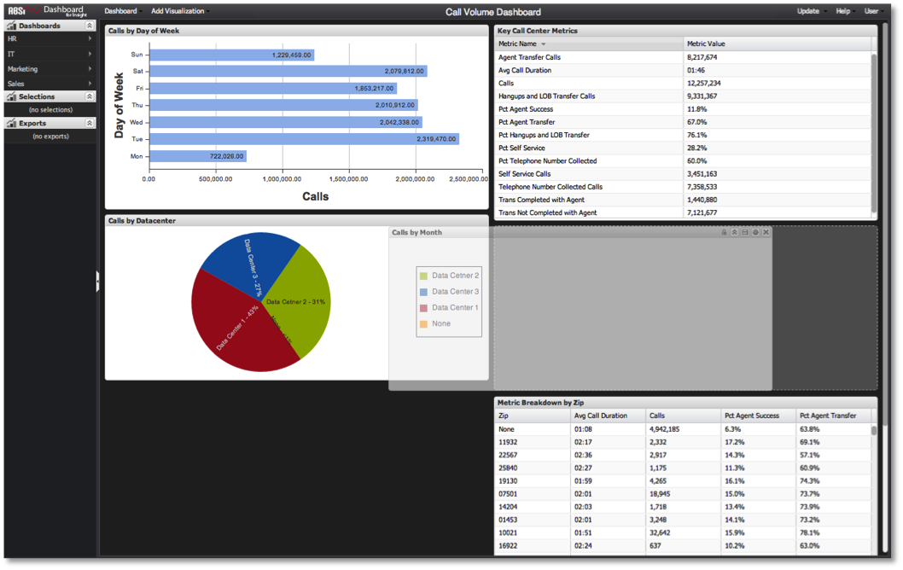

# ビジュアライゼーションの移動{#moving-visualizations}

{{eol}}

ビジュアライゼーションは、ダッシュボードキャンバス内で簡単に移動および並べ替えできます。

ビジュアライゼーションを移動するには、ビジュアライゼーションのタイトルバーをクリックし、ビジュアライゼーションをドラッグして、ダッシュボードキャンバス上の別の場所にドロップします。 ダッシュボードキャンバスは、ビジュアライゼーションを目的の場所に配置することで、ビジュアライゼーションの配置に役立ちます。 重複を避けるために、既存のビジュアライゼーションは移動されるビジュアライゼーションの領域を確保するために、自動的に上下に移動します。

