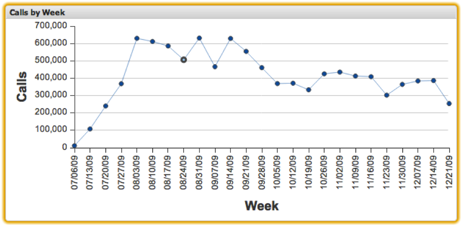

# 折れ線グラフ{#line-charts}

{{eol}}

折れ線グラフのビジュアライゼーションでは、x-y 軸の点と、隣接する点を結ぶ線として表される各データ要素を使用して、指標とディメンションのデータを視覚化できます。 折れ線グラフでは、最大 200 個の一意のデータ要素を一度にグラフに表示できます。 ディメンション値には X 軸に沿ったラベルが付けられ、指標の増分には Y 軸に沿ったラベルが付けられます。 折れ線グラフの 1 点にマウスを置くと、その時点の指標の値が正確に表示されます。

特定のポイントをクリックすると、折れ線グラフで選択を行うことができます。 Alt キーを押したままにすると、追加の項目をクリックしても選択が保持されます。 Alt キーを押しながらクリックすると、選択の値も切り替わります。 これは、既に選択されている項目のグループから 1 つの選択だけを削除する場合に便利です。

