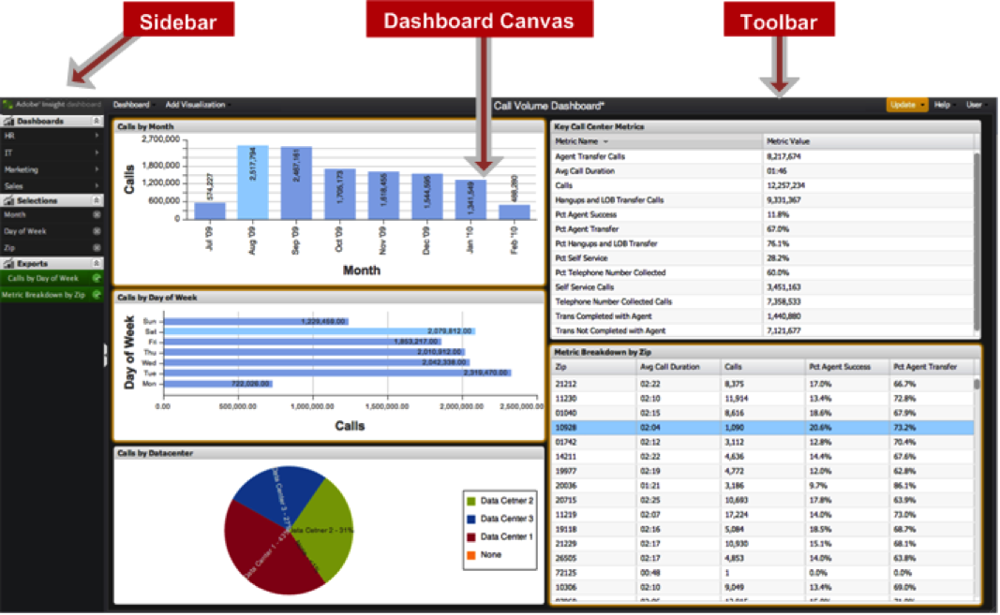

# ダッシュボードのユーザーインターフェイス{#dashboard-user-interface}

Data Workbenchダッシュボードには、機能メニューを含むサイドバーとツールバー、およびデータのビジュアライゼーションを表示するダッシュボードキャンバスが含まれています。

## ダッシュボードキャンバス{#section-39c9352f5e8d407e8d76c7f2e6267b3d}

ダッシュボードキャンバスは、ビジュアライゼーションの作成と操作に使用されるインターフェイスの領域です。

| 用語 | 定義 |
|---|---|
| ビジュアライゼーション | 設定された条件に基づいてグラフィカルに定義されたレンダリングデータ。 複数のビジュアライゼーションが1つのダッシュボードを構成しています。 |

## サイドバー {#section-12e155c782e74851b0dbaa00c40deb8c}

左側のサイドバーでは、定義済みのメニューにすばやくアクセスして表示できます。

| メニュー | 定義 |
|---|---|
| クイックアクセスメニュー | ダッシュボードをすばやく開くためのフライアウトメニュー。 |
| 選択メニュー | ダッシュボード内の現在の選択範囲をリストし、追加の詳細を提供し、選択範囲をいつでも削除できます。 |
| 書き出しメニュー | 保留中または完了したエクスポートをリストし、完了時にエクスポートを取得できるようにします。 |

## ツールバー {#section-f1c7d5b7fb37473f93cc533a7376c167}

上部のツールバーから、これらの特定のメニューにアクセスできます。 また、現在開いているダッシュボードのタイトルも表示されます。

| メニュー | 定義 |
|---|---|
| ダッシュボードメニュー | ダッシュボードを開く、作成する、保存する、書き出すためのドロップダウンメニュー。 |
| ビジュア追加ライゼーションメニュー | ダッシュボードにビジュアライゼーションを追加するためのドロップダウンメニュー。 |
| ダッシュボードのタイトル | 現在のダッシュボードのタイトルを表示します。 |
| メニューの更新 | **[!UICONTROL Update]**&#x200B;インジケーターをクリックすると、新しい選択や構成の変更を考慮して、現在のダッシュボードが更新されます。 このメニューでは、**[!UICONTROL Query-to]**&#x200B;パラメーターを調整する機能と、管理者向けの高度な機能がいくつか用意されています。 |
| ヘルプメニュー | このドロップダウンメニューは、アプリの「ユーザーガイド」、「FAQ」および「バージョン情報」の節にアクセスするために使用します。 |
| ユーザーメニュー | ログアウト、アカウント設定へのアクセス、および管理領域へのアクセスを行うためのドロップダウンメニュー（管理者のみ）。 |
