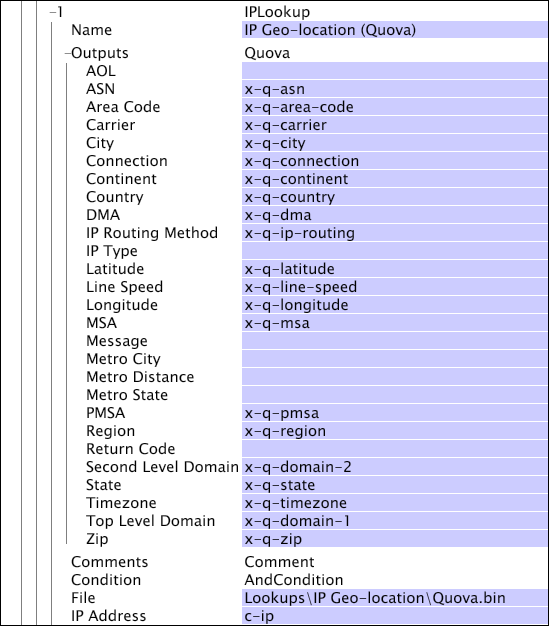

# IPLookup{#iplookup}

{{eol}}

IPLookup 変換は、IP Geo-Location データまたは IP Geo-Intelligence データ（各種ベンダーによって提供され、アドビ独自の形式に変換される）を受け取って、そのデータを分析用の地理情報に変換します。

2 [!DNL IPLookup] 変換は、新規追加/変換タイプメニューに表示されます。

* [!DNL IPLookup] Quova for [!DNL IP geo-location] データ

* [!DNL IPLookup] Digital Envoy for [!DNL IP geo-intelligence] データ

を定義する際に [!DNL IPLookup] 変換を行う場合は、 [!DNL IP geo-location] または [!DNL IP geo-intelligence] データ。

<table id="table_C438A30AB5E64160A5C486D6887B1D7E"> 
 <thead> 
  <tr> 
   <th colname="col1" class="entry"> パラメーター </th> 
   <th colname="col2" class="entry"> 説明 </th> 
   <th colname="col3" class="entry"> デフォルト </th> 
  </tr> 
 </thead>
 <tbody> 
  <tr> 
   <td colname="col1"> 名前 </td> 
   <td colname="col2"> 変換のわかりやすい名前。ここには任意の名前を入力することができます。 </td> 
   <td colname="col3"> </td> 
  </tr> 
  <tr> 
   <td colname="col1"> コメント </td> 
   <td colname="col2"> （オプション）。変換についてのメモ。 </td> 
   <td colname="col3"> </td> 
  </tr> 
  <tr> 
   <td colname="col1"> 条件 </td> 
   <td colname="col2"> この変換が適用される条件。 </td> 
   <td colname="col3"> </td> 
  </tr> 
  <tr> 
   <td colname="col1"> ファイル </td> 
   <td colname="col2"> ルックアップファイルのパスとファイル名。相対パスの基準は、Data Workbench サーバーのインストールディレクトリです。このファイルは、一般に、Data Workbench サーバーのインストールディレクトリにある Lookups ディレクトリに格納されます。 </td> 
   <td colname="col3"> </td> 
  </tr> 
  <tr> 
   <td colname="col1"> IP アドレス </td> 
   <td colname="col2"> IP アドレスの読み取り元となるフィールド。 </td> 
   <td colname="col3"> c-ip </td> 
  </tr> 
  <tr> 
   <td colname="col1"> Outputs </td> 
   <td colname="col2"> 
出力文字列の名前。 
 
 IPLookup Quova 変換と IPLookup Digital Envoy 変換は、出力パラメーターに違いがあります。IP ルックアップデータに合った適切な変換を使用してください。 
 </td> 
   <td colname="col3"> </td> 
  </tr> 
 </tbody> 
</table>

この例では、（ルックアップファイル [!DNL IP geo-location] 内の）[!DNL Quova.bin] データを使用して、一連の出力フィールドを作成します。出力データ（AOL、ASN、Area Code など）を使用して、訪問者トラフィックの地域別分析に使用するディメンションを作成できます。

