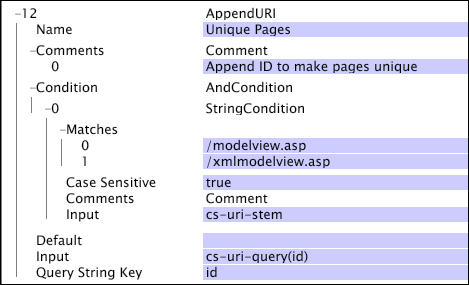

# AppendURI{#appenduri}

{{eol}}

データセット構築用ログエントリから取得されたデフォルトの値には、AppendURI 変換を利用して情報を付加することができます。

この変換によって、URI ディメンションの作成に使用される内部フィールドの最後に名前と値のペアが追加されます。名前と値のペアは、Query String Key パラメーターを名前として作成され、その値には、識別された Input パラメーターの値が使用されます。[!DNL AppendURI] コマンドでは、名前と値のペアを他の要素（[!DNL URI] ステムや、URI に既に適用されている [!DNL AppendURI] の処理結果）から分離するために必要な疑問符（?）とアンパサンド（&amp;）が適宜追加されます。

この [!DNL AppendURI] 変換は、 [!DNL Transformation.cfg] ファイルまたは [!DNL Transformation Dataset Include] ファイル。

| パラメーター | 説明 | デフォルト |
|---|---|---|
| 名前 | 変換のわかりやすい名前。ここには任意の名前を入力することができます。 |  |
| コメント | （オプション）。変換についてのメモ。 |  |
| 条件 | この変換が適用される条件。 |  |
| デフォルト | デフォルト値。条件が満たされたが、入力値が利用できない場合に使用されます。 |  |
| Input | URI の最後に付加する値のフィールド名。 |  |
| Query String Key | 付加される名前と値のペアを作成するときに使用する名前。 |  |

従来の MVC（Model-View-Controller）手法で構築された Web サイトがあるとします。このようなシステムでは、アクセスポイントとなる単一の Web ページを設けるのが普通です。こうしたサイトでは、システムのトラフィックパターンを可視化しても、興味深いデータが得られず、訪問者の利用状況やトラフィックフローの本質に迫ることが難しい場合があります。例えば、すべての Web リクエストが次の形式の URI に誘導される Web サイトを考えてみましょう。

* [!DNL https://www.examplesite.com/modelview.asp?id=login&name=bob]

modelview という ASP ページは、すべてのトラフィックが集まるポイントであり、クエリーの id フィールドの値によってそのアクションが決まります。この場合、デフォルトでは、次に示すエントリが 1 つだけ、URI ディメンションに格納されます。

* [!DNL modelview.asp]

サイトを経由するトラフィックのマッピングとして、これでは明らかに実用性に欠けます。すべてのトラフィックが単一の URI に集められているからです。このシナリオの問題点を解消し、Web サイトの基礎となるアーキテクチャについて、より有益な情報が得られるようにするには、[!DNL AppendURI] を使用して、cs-uri-query フィールドに格納されている名前と値の一意のペアをいくつか、ビジュアライゼーションに使用する URI ディメンションに移動します。以下の図は、そうした変換の詳細を示したものです。

この例のシステムは、[!DNL modelview.asp] と [!DNL xmlmodelview.asp] という 2 つのページですべてのリクエストを処理しています。一方のページはブラウザートラフィック用で、もう一方のページはシステム間の XML 通信用です。アプリケーションサーバープロセスは、実行するアクションを cs-uri-query の id 名に基づいて決定します。したがって、id フィールドから値を抽出して、URI に付加することが可能です。結果、Web サイト訪問者のトラフィックを反映した、様々なバリエーションの URI を収集することができます。この例の [!DNL String Match] 条件は、変換の適用先となるログエントリを決定するものです。cs-uri-stem フィールドから目的の 2 つの Web ページを探し、それ以外はすべて無視しています。入力（名前と値のペアの値）は、cs-uri-query(id) の結果、つまり「login」です。Query String Key パラメーターの指定に従って、「id」という名前が付加されます。したがって、この例の受信 cs-uri 値に対しては、 [!DNL URI] 次元は [!DNL /modelview.asp&id=login].
