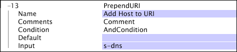

# PrependURI{#prependuri}

PrependURI 変換は、AppendURI 変換と同様、URI ディメンションを構築するときに Data Workbench サーバーで使用される内部フィールドに作用します。

[!DNL PrependURI] 変換は、URI に含まれている値の前に、指定された入力フィールドの値を追加します。

| パラメーター | 説明 | デフォルト |
|---|---|---|
| 名前 | 変換のわかりやすい名前。ここには任意の名前を入力することができます。 |  |
| Comments | (オプション)変換についてのメモ。 |  |
| Condition | この変換が適用される条件。 |  |
| Default | デフォルト値。条件が満たされたが、入力値が利用できない場合に使用されます。 |  |
| Input | URI の先頭に付加する値のフィールド名。 |  |

次の例は、URI の先頭に s-dns フィールドを単純に付加します。クライアントデバイスからリクエストされたドメインを含める形で URI ディメンションの情報を補います。

この例で、次の URI の先頭に s-dns フィールドを付加するとします。

* [!DNL /modelview.asp&id=login]

この場合、次の URL が得られます。

* [!DNL www.adobe.com/modelview.asp?id=login]

リクエストされたドメインが URI に追加されました。
