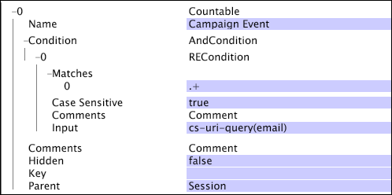

# 可算ディメンション{#countable-dimensions}

可算ディメンションのエレメントは、システムによってカウントすることができます。

一般に、可算ディメンションは合計の指標を作成するときに使用します。作成した指標からは、そのディメンションのすべてのエレメントの数（合計）が得られます。可算ディメンションを定義することで、予約数、商品の注文件数など、事例の数をカウントすることができます。例えば、カウント可能なエレメント（特定のオンラインストアへの注文に対応するログエントリ）が含まれる Orders という可算ディメンションを定義することができます。ビジュアライゼーション内で注文件数を表示したい場合、Orders という合計指標を定義し、ディメンションごとの合計指標を評価したり、合計指標にフィルターを適用したりすることが可能です。

可算ディメンションは他のディメンションの親または他の可算ディメンションの子にすることができます。

>[!NOTE]
>
>何かのカウントのみを提供するディメンションが必要な場合は、数値ディメンションをCOUNTの演算と共に使用する必要があります。 数値ディメ [ンションを参照](../../../../home/c-dataset-const-proc/c-ex-dim/c-types-ex-dim/c-num-dim.md#concept-8513b9afaff447c8b334410b565b91ed)。

可算ディメンションは、以下のパラメーターによって定義します。

<table id="table_9F3F093F5B074EA68CA4DCE731161F6C"> 
 <thead> 
  <tr> 
   <th colname="col1" class="entry"> パラメーター </th> 
   <th colname="col2" class="entry"> 説明 </th> 
   <th colname="col3" class="entry"> デフォルト </th> 
  </tr> 
 </thead>
 <tbody> 
  <tr> 
   <td colname="col1"> 名前 </td> 
   <td colname="col2"> Data Workbench のユーザーが見てわかりやすいディメンションの名前。ディメンション名にハイフン（-）を含めることはできません。 </td> 
   <td colname="col3"> </td> 
  </tr> 
  <tr> 
   <td colname="col1"> Comments </td> 
   <td colname="col2"> (オプション)拡張ディメンションについてのメモ。 </td> 
   <td colname="col3"> </td> 
  </tr> 
  <tr> 
   <td colname="col1"> Condition </td> 
   <td colname="col2"> 入力フィールドが可算ディメンションの作成に寄与する条件。ディメンションという切り口から見えるログエントリとその（データセットスキーマにおける）すべての子の集合が、指定された条件によって制限されます。 </td> 
   <td colname="col3"> </td> 
  </tr> 
  <tr> 
   <td colname="col1"> Hidden </td> 
   <td colname="col2"> Data Workbench のインターフェイスにディメンションを表示するかどうかを指定します。デフォルトでは false に設定されています。例えば、指標の基準としてのみ使用されるディメンションであれば、このパラメーターを true に設定して、Data Workbench に表示されないようにすることができます。 </td> 
   <td colname="col3"> false </td> 
  </tr> 
  <tr> 
   <td colname="col1"> キー </td> 
   <td colname="col2"> 
(オプション)キーとして使用するフィールドの名前。このパラメーターを定義した場合、可算ディメンションのエレメントは、その親のエレメントと、キーとして指定したフィールドの個別の値との組み合わせごとに存在することになります。 
 
 可算ディメンションの各エレメントは、連続性を持ったログエントリの集合に関連付けられている必要があります。そのため、ログエントリがキーごとに並んでいなかった場合、キーフィールドが変化するたびに、可算ディメンションのエレメントが作成されます。そのような状況を回避するために、時系列に連続した一意のキーを使用することをお勧めします。 
 </td> 
   <td colname="col3"> </td> 
  </tr> 
  <tr> 
   <td colname="col1"> Parent </td> 
   <td colname="col2"> 
親ディメンションの名前。すべての可算ディメンションは、親ディメンションになることができます。特定のディメンションをデータセットのスキーマにおける最上位のディメンションとするには、このパラメーターを「root」に設定します。定義済みのディメンションは、データセットのルート可算ディメンションになります。例えば、Site を使用している場合、Visitor ディメンションがデータセットのルート可算ディメンションとなります。 
 
 
注意：ルート可算ディメンションは、必ずしもデータ内の追跡 ID に関連付けられている必要はありません。ただし、データセットのルート可算ディメンションを設定するときに、そのキーとして追跡 ID フィールド（x-trackingid）を使用することをお勧めします。そうすることで、ルート可算の各エレメントが x-trackingid の一意の値に関連付けられ、各エレメントに関するすべてのデータがグループ化されます。別の方法でデータセットを設定したい場合は、アドビにお問い合わせください。 
 
 </td> 
   <td colname="col3"> </td> 
  </tr> 
 </tbody> 
</table>

次の例は、Web サイトトラフィックから収集されたイベントデータを使用する可算ディメンションの定義です。この可算ディメンションは、特定のセッション内の Web キャンペーンイベントをカウントします。Web サーバーに対するすべての電子メールキャンペーンリソース要求が、「email=」を含んだ cs-uri-query で行われることを前提としています。この例で関心の対象となるのは、特定のセッション期間中、電子メールキャンペーンに対して訪問者が反応を示した回数であって、cs-uri-query(email) フィールドの実際の値ではありません。

次の例も、Web サイトトラフィックから収集されたイベントデータを使用する可算ディメンションの定義を示しています。先ほどとの違いは、Key パラメーターが定義されていることです。可算ディメンションである Session には、そのキーとして x-session-key フィールドが使用されています（x-session-key フィールドは、[!DNL Sessionize] 変換の出力であり、セッションごとに一意の値を持ちます）。Visitor ディメンション（親）のエレメントと x-session-key フィールドの一意の組み合わせが、それぞれ Session ディメンションのエレメントとなります。

