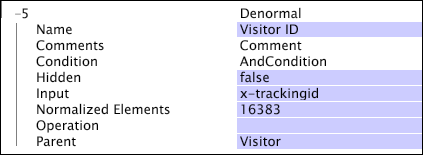

# 非正規ディメンション{#denormal-dimensions}

{{eol}}

非正規ディメンションは、その親の可算ディメンションとの間に 1 対 1 の関係を持ちます。

必要なディメンションが、その親の各要素について一意の要素を含んでいるときは、いつでも非正規ディメンションを定義することができます。例： [!DNL EMail Address] は、訪問者の親を持つ非正規ディメンションです。 訪問者には一人ひとり電子メールアドレスがあり、電子メールアドレスディメンション内の各エレメントは、1 人の訪問者の電子メールアドレスに対応します。2 人の訪問者が同じ電子メールアドレスを持っていたとしても、そのアドレスは、電子メールアドレスディメンションの別個のエレメントです。

非正規ディメンションは、あらゆるテーブルのビジュアライゼーションや詳細テーブルで使用できるほか、フィルターの作成に使用することができます。また、Data Workbench サーバーのセグメントエクスポート機能と共に非正規ディメンションを使用して、フィールド ( [!DNL Tracking ID] または [!DNL EMail Address]) に含まれるデータを抽出します。 エクスポートするセグメントデータはプロファイルの中でディメンションとして定義されていなければならないので、フィールドデータの未加工の文字列を格納する非正規ディメンションを作成する必要があります。

>[!NOTE]
>
>通常のディメンションが期待されるテーブルやその他のビジュアライゼーションで非正規ディメンションを使用する場合、派生された非正規ディメンションが自動的に作成されます。 派生された非正規ディメンションは、親ディメンションと 1 対多の関係を持ちます。

詳細テーブルのビジュアライゼーションとフィルターについて詳しくは、『*Data Workbench ユーザーガイド*』の「分析のビジュアライゼーション」という章を参照してください。セグメントのエクスポートについて詳しくは、『*Data Workbench ユーザーガイド*』の「インターフェイスと分析機能の設定」という章を参照してください。

>[!NOTE]
>
>非正規ディメンションは、クエリ時間とディスク容量で非常にコストがかかる場合があります。 親が[!DNL Page View]ページビューで、入力文字列が平均 50 バイトである非正規ディメンションの場合、標準的な大きめのデータセット（シンプル／数値の ディメンションで約 13 個、Session レベルのディメンションで約 125 個）において、バッファーに 25 GB のデータが追加される可能性があります。データセットに非正規ディメンションを追加する場合は必ず、パフォーマンスへの影響を慎重に考慮してください。

非正規ディメンションは、以下のパラメーターによって定義します。

<table id="table_532AD791E39B4CF296FFA1C33FB8302E"> 
 <thead> 
  <tr> 
   <th colname="col1" class="entry"> パラメーター </th> 
   <th colname="col2" class="entry"> 説明 </th> 
   <th colname="col3" class="entry"> デフォルト </th> 
  </tr> 
 </thead>
 <tbody> 
  <tr> 
   <td colname="col1"> 名前 </td> 
   <td colname="col2"> Data Workbench に表示される、ディメンションのわかりやすい名前。ディメンション名にハイフン（-）を含めることはできません。 </td> 
   <td colname="col3"> </td> 
  </tr> 
  <tr> 
   <td colname="col1"> コメント </td> 
   <td colname="col2"> （オプション）。拡張ディメンションについてのメモ。 </td> 
   <td colname="col3"> </td> 
  </tr> 
  <tr> 
   <td colname="col1"> 条件 </td> 
   <td colname="col2"> 親と入力フィールドの値との関係を作成する条件。 </td> 
   <td colname="col3"> </td> 
  </tr> 
  <tr> 
   <td colname="col1"> Hidden </td> 
   <td colname="col2"> Data Workbench のインターフェイスにディメンションを表示するかどうかを指定します。デフォルトでは false に設定されています。例えば、指標の基準としてのみ使用されるディメンションであれば、このパラメーターを true に設定して、Data Workbench に表示されないようにすることができます。 </td> 
   <td colname="col3"> true </td> 
  </tr> 
  <tr> 
   <td colname="col1"> Input </td> 
   <td colname="col2"> 親ディメンション（Parent）に関連付ける値。 </td> 
   <td colname="col3"> </td> 
  </tr> 
  <tr> 
   <td colname="col1"> Normalized Elements </td> 
   <td colname="col2"> システムメモリに名前が格納されるディメンションエレメントの数を指定するパフォーマンスチューニングパラメーター。このパラメーターの設定値を大きくすると、非正規ディメンションで使用される RAM が増え、クエリーが高速化されます。デフォルト値は 16383 です。 </td> 
   <td colname="col3"> </td> 
  </tr> 
  <tr> 
   <td colname="col1"> 操作 </td> 
   <td colname="col2"> 
利用可能な演算は次のとおりです。 
 
 
     <ul id="ul_CCDC45838A3941BD949B6D21EA0492B3"> 
      <li id="li_F33898192A82437692B5C15684EFCF64"> FIRST NONBLANK：ブランクではない最初の入力値が使用されます。最初のログエントリからの入力値であるとは限りません。Input がベクトルフィールドである場合、関連するログエントリのベクトルの先頭行が使用されます。 </li> 
      <li id="li_4ADD0A368BB74B64AD29126C8E7B333F"> FIRST ROW：入力がブランクであった場合も含め、親ディメンションエレメントに関連した最初のログエントリの値が使用されます。Input がベクトルフィールドである場合、関連するログエントリのベクトルの先頭行が使用されます。その値がブランクであるか、数値以外であった場合、あるいは、関連するログエントリがディメンションの Condition を満たしていない場合は、いずれの値も使用されません。 </li> 
      <li id="li_C93CA22ADA634F21A6488BB3BEE7CB23"> LAST NONBLANK：ブランクではない最後の入力値が使用されます。最後のログエントリからの入力値であるとは限りません。Input がベクトルフィールドである場合、関連するログエントリのベクトルの先頭行が使用されます。 </li> 
      <li id="li_2FFE585521B14FE5ABBF66AAC47F22C4"> LAST ROW：入力がブランクであった場合も含め、親ディメンションエレメントに関連した最後のログエントリの値が使用されます。Input がベクトルフィールドである場合、関連するログエントリのベクトルの先頭行が使用されます。その値がブランクであるか、数値以外であった場合、あるいは、関連するログエントリがディメンションの Condition を満たしていない場合は、いずれの値も使用されません。 </li> 
     </ul> 
 
 
注意：Operation の結果、値が得られなかった場合は、ブランク値（""）が使用されます。 
 
 
 意図したディメンションが確実に定義されるように演算を指定する必要があります。 
 </td> 
   <td colname="col3"> </td> 
  </tr> 
  <tr> 
   <td colname="col1"> Parent </td> 
   <td colname="col2"> 親ディメンションの名前。すべての可算ディメンションは、親ディメンションになることができます。 </td> 
   <td colname="col3"> </td> 
  </tr> 
 </tbody> 
</table>

この例に示した非正規ディメンションは、x-trackingid フィールドに含まれるすべてのデータを入力として受け取り、Visitor ID という名前のディメンションに追加します。作成済みの訪問者のセグメントについて、Visitor ID ディメンション（とその他定義済みのあらゆるディメンション）内のデータをエクスポートすることができます。

