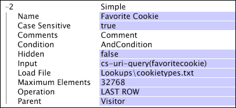

# シンプルディメンション{#simple-dimensions}

シンプルディメンションは、その親の可算ディメンションとの間に 1 対多の関係を持ちます。

シンプルディメンションは必ず、可算ディメンションの子として存在します。シンプルディメンションは、その親ディメンションのエレメントが持つプロパティを表したもの、と考えることができます。例えば、Web データを扱っている場合、Visitor を親ディメンションとするシンプルディメンションとして、Visitor Referrer ディメンションを定義することができます。Visitor Referrer ディメンションは、Visitor ディメンションを切り口として各訪問者の最初の HTTP リファラーを表します。Visitor ディメンションの各訪問者が持つ訪問者リファラーは 1 つだけですが、同じ訪問者リファラーを持つ訪問者は複数存在する可能性があります。したがって、Visitor Referrer ディメンションと Visitor ディメンションとの間には 1 対多の関係が存在することになります。

シンプルディメンションは、以下のパラメーターによって定義します。

<table id="table_E6F729DFA226459DBFC1776CE8CB81F8"> 
 <thead> 
  <tr> 
   <th colname="col1" class="entry"> パラメーター </th> 
   <th colname="col2" class="entry"> 説明 </th> 
   <th colname="col3" class="entry"> デフォルト </th> 
  </tr> 
 </thead>
 <tbody> 
  <tr> 
   <td colname="col1"> 名前 </td> 
   <td colname="col2"> Data Workbench に表示される、ディメンションのわかりやすい名前。ディメンション名にハイフン（-）を含めることはできません。 </td> 
   <td colname="col3"> </td> 
  </tr> 
  <tr> 
   <td colname="col1"> Comments </td> 
   <td colname="col2"> (オプション)拡張ディメンションについてのメモ。 </td> 
   <td colname="col3"> </td> 
  </tr> 
  <tr> 
   <td colname="col1"> Condition </td> 
   <td colname="col2"> 親と入力フィールドの値との関係を作成する条件。 </td> 
   <td colname="col3"> </td> 
  </tr> 
  <tr> 
   <td colname="col1"> Hidden </td> 
   <td colname="col2"> Data Workbench のインターフェイスにディメンションを表示するかどうかを指定します。デフォルトでは false に設定されています。例えば、指標の基準としてのみ使用されるディメンションであれば、このパラメーターを true に設定して、Data Workbench に表示されないようにすることができます。 </td> 
   <td colname="col3"> false </td> 
  </tr> 
  <tr> 
   <td colname="col1"> Input </td> 
   <td colname="col2"> 親ディメンション（Parent）に関連付ける値のフィールド。 </td> 
   <td colname="col3"> </td> 
  </tr> 
  <tr> 
   <td colname="col1"> Load File </td> 
   <td colname="col2"> 
(オプション)対象の関係について用意した値のファイル。ロードファイルは、次のいずれかの状況で使用します。 
 
 
     <ul id="ul_056C4A8E46AA479397DC63173C035D5C"> 
      <li id="li_C26EB5A4AB3C4BEB8EB3A217A5A2377E"> 決まった並び順が値に存在し、Data Workbench で表示したときに維持する必要があるとき。例えば、Quarter ディメンションを作成する場合、そのエレメント（四半期）は常に時系列で表示する必要があります。 </li> 
      <li id="li_5D4DF56BC6124D038A7260131B1F3DB3"> データには見つからなかった場合でも Data Workbench には表示すべき値のプレースホルダーを作成したいとき。 </li> 
     </ul> 
 
 このファイルに存在しない値が検出された場合、Data Workbench で表示したときに、一連の値の最後にその値が追加されます。 
 </td> 
   <td colname="col3"> </td> 
  </tr> 
  <tr> 
   <td colname="col1"> Operation </td> 
   <td colname="col2"> 
利用可能な演算は次のとおりです。 
 
 
     <ul id="ul_88AE4279413C42609D8B53EC64B5E913"> 
      <li id="li_DD9623D006844BC28B2AAA8E12AA04E1"> FIRST NONBLANK：ブランクではない最初の入力値が使用されます。最初のログエントリからの入力値であるとは限りません。Input がベクトルフィールドである場合、関連するログエントリのベクトルの先頭行が使用されます。 </li> 
      <li id="li_0FBE7F0B7B9744D994ECEDAA08F0045C"> FIRST ROW：入力がブランクであった場合も含め、親ディメンションエレメントに関連した最初のログエントリの値が使用されます。Input がベクトルフィールドである場合、関連するログエントリのベクトルの先頭行が使用されます。その値がブランクであるか、数値以外であった場合、あるいは、関連するログエントリがディメンションの Condition を満たしていない場合は、いずれの値も使用されません。 </li> 
      <li id="li_C17190BC699D4A099DC5326C07D1044D"> LAST NONBLANK：ブランクではない最後の入力値が使用されます。最後のログエントリからの入力値であるとは限りません。Input がベクトルフィールドである場合、関連するログエントリのベクトルの先頭行が使用されます。 </li> 
      <li id="li_00BAE86F12004C098F6A455908DB7062"> LAST ROW：入力がブランクであった場合も含め、親ディメンションエレメントに関連した最後のログエントリの値が使用されます。Input がベクトルフィールドである場合、関連するログエントリのベクトルの先頭行が使用されます。その値がブランクであるか、数値以外であった場合、あるいは、関連するログエントリがディメンションの Condition を満たしていない場合は、いずれの値も使用されません。 </li> 
     </ul> 
 
 
注意：特定のログエントリに対する演算の結果、値が得られなかった場合またはブランク値であった場合、対応する親ディメンションのエレメントは、シンプルディメンションの「None」エレメントに関連付けられます。 
 
 
 意図したディメンションが確実に定義されるように演算を指定する必要があります。 
 </td> 
   <td colname="col3"> </td> 
  </tr> 
  <tr> 
   <td colname="col1"> Parent </td> 
   <td colname="col2"> 親ディメンションの名前。すべての可算ディメンションは、親ディメンションになることができます。 </td> 
   <td colname="col3"> </td> 
  </tr> 
 </tbody> 
</table>

次の例は、Web サイトトラフィックから収集されたイベントデータとロードファイルを使用するシンプルディメンションの定義です。

サイト訪問者がお気に入りの Girl Scout クッキーに投票するケースを例として考えてみましょう。Web ページは、この投票を受け付けて、名前と値のペア（favoritecookie）の形式で Web サーバーに返します。カウントするのは各訪問者につき 1 票ですが、訪問者は、気が変われば再投票することができます。これは、1 対多の関係に相当します。1 人の訪問者は複数の票を持ちますが、1 つの票に関連付けられる訪問者は 1 人だけです。そのため、このディメンションの親は訪問者（訪問者 1 人につき 1 票のみ）で、演算は LAST ROW（気が変わったら再投票可能）となります。

票を獲得できなかったクッキーも Data Workbench に表示されるように、全種類のクッキーについてプレースホルダーが必要です。このような理由から、選択の候補となるクッキーの種類をリストしたロードファイルが定義されています。このファイルは、[!DNL cookietypes.txt] という名前で保存されており、次のようなデータを含んでいます。

Animal Treasures

Caramel Delights

Lemon Pastry Creams

Peanut Butter Patties

Shortbreads

Thin Mints

完成したディメンションの定義を次に示します。

