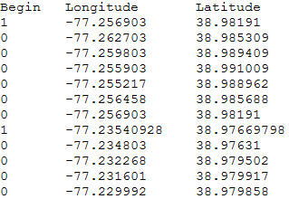

# タブ区切り値ファイルを参照するベクターレイヤー{#vector-layers-referencing-tab-separated-values-files}

タブ区切り値（.tsv）ファイルを参照するベクトルレイヤーを作成すると、描画手順および経度と緯度のデータを .tsv ファイルから取得することによってベクトルデータが得られます。

[!DNL .tsv]ファイルを参照するベクトルレイヤーを定義するには、次のファイルが必要です。

* **経度と緯度のデータなど、グローブ上にベクトルを描くために使用するデータを含む [!DNL .tsv]** ファイルです。[!DNL .tsv]ファイルに必要な形式について詳しくは、[ベクトルTSVファイルの形式](../../../../home/c-geo-oview/c-wk-img-lyrs/c-wk-vctr-lyrs/c-tab-sep-val-files.md#section-a29012c9ff4444ac8a6d41c68482828e)を参照してください。

* **フ** ァイルの場所を指定するレイヤー [!DNL .tsv] ファイル。レイヤーファイルの必要な形式について詳しくは、「[ベクトルレイヤーファイルの形式](../../../../home/c-geo-oview/c-wk-img-lyrs/c-wk-vctr-lyrs/c-tab-sep-val-files.md#section-c430923f341f4c93852e9f24b61e82bf)」を参照してください。

## ベクトルTSVファイル形式{#section-a29012c9ff4444ac8a6d41c68482828e}

[!DNL .tsv]ファイルには、次の3つのタブ区切り列を含める必要があります。

* **[!DNL Begin]:** この列は、新しい行を開始するかどうかを示す必要があります。この列の値は、0（新しい行を開始しない）か 1（新しい行を開始する）です。
* **[!DNL Longitude]:** この列には経度の値を含める必要があります。
* **[!DNL Latitude]:** この列には緯度の値を含める必要があります。

>[!NOTE]
>
>その他の列は無視されます。

次に、ベクトルレイヤーのデータを含むサンプル[!DNL .tsv]ファイルを示します。



## ベクトルレイヤーファイル形式{#section-c430923f341f4c93852e9f24b61e82bf}

[!DNL .tsv]ファイルを参照する各ベクトルレイヤーファイルは、次のテンプレートを使用してフォーマットする必要があります。

```
Layer = VectorLayer:
  TSV Files = vector: n items
    0 = string: Maps\\File Name.tsv
    1 = string: Maps\\File Name.tsv
    . . .
    n-1 = string: Maps\\File Name.tsv
  Color = v3d: color vector
  Alpha = double: alpha
  Width = double: width
  Error Factor = double: error factor
```

<table id="table_152F73536AB9403AB43854B81D6A9A15"> 
 <thead> 
  <tr> 
   <th colname="col1" class="entry"> パラメーター </th> 
   <th colname="col2" class="entry"> 説明 </th> 
  </tr> 
 </thead>
 <tbody> 
  <tr> 
   <td colname="col1"> TSV Files </td> 
   <td colname="col2"> <p>ベクトルデータを含む <span class="filepath">.tsv</span> ファイルへのパス。 </p> <p>例：<span class="filepath">Maps\\USVectorData.tsv</span> </p> </td> 
  </tr> 
  <tr> 
   <td colname="col1"> Color </td> 
   <td colname="col2"> RGB カラーベクトルで、(red,green,blue) として表されます。ベクトル内のカラーごとに、0.0 ～ 1.0 の値を入力できます。例えば、(1.0, 0.0, 0.0) は明るい赤で、(0.5, 0.5, 0.5) はグレーです。 </td> 
  </tr> 
  <tr> 
   <td colname="col1"> Alpha </td> 
   <td colname="col2"> グローブ上に表示されるベクトルの透明度を制御します。範囲は 0 ～ 1 で、0 が最も透明になります。 </td> 
  </tr> 
  <tr> 
   <td colname="col1"> Width </td> 
   <td colname="col2"> （オプション）データの幅をピクセル単位で設定します。推奨範囲は 1 ～ 4 です。 </td> 
  </tr> 
  <tr> 
   <td colname="col1"> Error Factor </td> 
   <td colname="col2"> ベクトルをどれくらい正確に描画するかを制御します。値が大きくなると、ベクトルの描画精度は低下しますが、高速になります。デフォルト値は 5 です。 </td> 
  </tr> 
 </tbody> 
</table>
