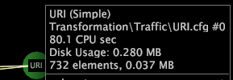

# パフォーマンスデータの表示{#display-performance-data}

{{eol}}

変換または拡張ディメンションのパフォーマンスデータの表示に関する情報です。

* 依存関係マップ内で右クリックし、 **[!UICONTROL Show Performance Data]**. 有効にすると、の左側に X が表示されます。 [!DNL Show Performance Data]. 変換または拡張ディメンションのノードを右クリックすると、以下のパフォーマンス情報が表示されます。

   * 変換の実行または拡張ディメンションの作成に必要な CPU 秒数
   * 拡張ディメンションの保存に必要なメモリ量
   * 拡張ディメンション内の要素数
   * 拡張ディメンション内の要素名のリストの保存に必要なメモリ量

