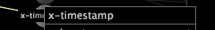

# ノードの詳細の表示{#view-node-details}

プロファイルコンポーネントの識別情報の表示に関する情報です。

* ノードを右クリックして、ウィンドウの上部に識別情報を表示します。表示される識別情報は、コンポーネントのタイプで決まります。

**ログソース**

ログソースの名前と、ログソースが定義されているファイルの名前.

**フィールド**

フィールドの名前.

**変換**

変換のタイプと名前、変換が定義されているファイルの名前およびファイル内の変換の番号.

>[!NOTE]
>
>Performance information for the transformation is displayed only if the [!DNL Show Performance Data] option is enabled for the dependency map. 詳しくは、「パフォーマンスデータの [表示」を参照してくださ](../../../../../home/c-get-started/c-admin-intrf/c-dataset-mgrs/c-dep-maps/c-disp-perf-data.md#concept-974e2bac3e184f0dab530e63aa4f5ecb)い。

**拡張ディメンション**

拡張ディメンションの名前とタイプ、ディメンションが定義されているファイルの名前およびファイル内のディメンションの番号.

>[!NOTE]
>
>Performance information for the extended dimension is displayed only if the [!DNL Show Performance Data] option is enabled for the dependency map. 詳しくは、「パフォーマンスデータの [表示」を参照してくださ](../../../../../home/c-get-started/c-admin-intrf/c-dataset-mgrs/c-dep-maps/c-disp-perf-data.md#concept-974e2bac3e184f0dab530e63aa4f5ecb)い。

**指標**

指標の名前.

**派生ディメンション**

派生ディメンションの名前.

**フィルター**

データセット内で定義されている場合、フィルターが定義されている設定ファイルのパスとフィルターの名前.

**ワークスペースとレポート**

プロファイルのワークスペースまたはレポートのディレクトリ内でのワークスペースまたはレポートのパス.

**メニューオプション**

プロファイルのメニューディレクトリ内のメニュー項目のパス.

**プロファイルコンポーネントの入力または出力を表示するには**

* Right-click the desired node and click **[!UICONTROL Inputs]** or **[!UICONTROL Outputs]**. 入力または出力のリストが表示されます。

