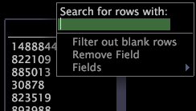

# フィールドビューア内でのフィルタリング{#filter-within-a-field-viewer}

{{eol}}

特定のテキストを検索したり、空白行を除外したりして、フィールドビューアに表示される値をフィルタリングできます。

**フィールドビューア内でフィルタリングするには**

1. 値を検索するフィールドの列内で右クリックします。
1. I

   の下のテキストボックス [!DNL Search for rows with]、検索するテキストを入力します。 パターンマッチング用の正規表現を入力することもできます。

テキストを含むフィールドの値または正規表現を満たすフィールドの値が、フィールドビューアに表示されます。検索結果の表示では、列名が赤でハイライトされます。

正規表現については、『*データセット設定ガイド*』を参照してください。

**空白行を除外するには**

* 空白行を除外するフィールドの列内で右クリックし、 **[!UICONTROL Filter out blank rows]**.

このオプションを有効にすると、左側に X が表示され、列名が赤でハイライトされます。
