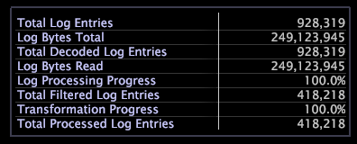

# 処理の凡例{#processing-legend}

処理の凡例には、特定のサーバーのデータ処理および変換に関する詳細情報が表示されます。この情報を使用して、再処理および再変換中のデータの進行状況を追跡できます。

次の表に、[!DNL Processing Legend]を使用して完了できるタスクを示します。

<table id="table_6149250C44B14C44A3CB1CEF68B280C6"> 
 <thead> 
  <tr> 
   <th colname="col1" class="entry"> 実行する作業... </th> 
   <th colname="col2" class="entry"> 手順... </th> 
  </tr> 
 </thead>
 <tbody> 
  <tr> 
   <td colname="col1"> 
すべてのデータの合計サイズを表示するには 
 </td> 
   <td colname="col2"> 
「ログエントリの合計」フィールドおよび「ログの合計バイト数」フィールドの値を確認します。 
 </td> 
  </tr> 
  <tr> 
   <td colname="col1"> 
フィルタリングが機能しているか確認するには 
 </td> 
   <td colname="col2"> 
「フィルター適用済みログエントリの合計」フィールドの値を確認します。値が 0 の場合はフィルタリングが機能していないので、設定を確認してこの問題に対処する必要があります。 
 </td> 
  </tr> 
  <tr> 
   <td colname="col1"> 
処理の進行状況を確認するには 
 </td> 
   <td colname="col2"> 
「ログ処理の進行状況」フィールドの値を確認します。この割合は、再処理がどの程度完了したかを示します。 
 
データセットを絞り込むために再処理を行う場合、デコード済みログエントリの合計の数値とフィルター適用済みログエントリの合計の数値を監視したいことがあります。 
 </td> 
  </tr> 
  <tr> 
   <td colname="col1"> 
変換の進行状況を確認するには 
 </td> 
   <td colname="col2"> 
「変換の進行状況」フィールドの値を確認します。この割合は、変換がどの程度完了したかを示します。 
 </td> 
  </tr> 
 </tbody> 
</table>
