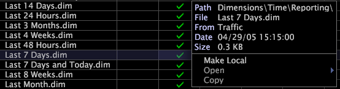

# 派生ディメンションの使用{#work-with-derived-dimensions}

Data Workbenchを使用して作成する新しいディメンション（派生ディメンション）は、クライアント側のディメンションです。

Data Workbenchサーバーコンピューター上のデータセットの構築と更新プロセス（[!DNL Transformation.cfg]ファイル内）でこれらのディメンションを定義する代わりに、派生ディメンションを作成し、プロファイル内の[!DNL .dim]ファイルとして個別に保存します。 その結果、データセットを再処理することなく、既存のディメンションを変更したり、新しい派生ディメンションを作成したりできます。

>[!NOTE]
>
>この節で説明するディメンションについて詳しくは、該当するディメンションData Workbenchガイドを参照してください。

データセットの設定および更新プロセスについて詳しくは、『*データセット設定ガイド*』を参照してください。

## 派生ディメンション{#section-fd9b6ca13a8f4aa9bbc2fff3ef15cb76}の作成

派生ディメンションを作成するには、既存のディメンションをコピーして変更することも、ビジュアライゼーションからディメンションを保存することもできます。

## 既存のディメンションから派生ディメンションを作成する{#section-f46c2d3ab0a5416c98d6e79d18d99fa1}

ほとんどの場合、ユーザーは既存のディメンションから新しい時間ディメンションを作成します。例えば、既存の「Last 7 Days」ディメンションから新しい「Last 5 Days」ディメンションを作成できます。

1. [!DNL Profile Manager]の&#x200B;*profile name*&#x200B;列で、作成するディメンションに類似したディメンションのチェックマークを右クリックし、「**[!UICONTROL Copy]**」をクリックします。

   例えば、[!DNL Traffic]プロファイルのReportingフォルダーから[!DNL Last 7 Days.dim]をコピーするには、[!DNL Traffic]列のファイル名のチェックマークを右クリックし、「**[!UICONTROL Copy]**」をクリックします。

   

1. コピーしたディメンションを保存するフォルダーの[!DNL User]列を右クリックし、「**[!UICONTROL Paste]**」をクリックします。

   ディメンションが選択した Dimensions フォルダーに表示され、[!DNL User] 列にチェックマークが付きます。

1. 新しいディメンションの名前を変更するには、[!DNL User]列のチェックマークを右クリックし、新しい名前を[!DNL File]フィールドに入力します。
1. 右クリックメニューから&#x200B;**[!UICONTROL Open]** / **[!UICONTROL from the workbench]**&#x200B;をクリックします。 ディメンションを定義するパラメーターが表示されます。
1. 新しいディメンションを定義する必要に応じてパラメーターを変更します。

   時間ディメンションでは、Count パラメーターと Range パラメーターのみを変更する必要がある場合がほとんどです。

1. ファイルを保存するには、ウィンドウ上部の&#x200B;**[!UICONTROL (modified)]**&#x200B;を右クリックし、「**[!UICONTROL Save]**」をクリックします。

   作成したディメンションをプロファイルのすべてのユーザーが使用できるようにする場合は、[!DNL Profile Manager]を使用して、作成したディメンションをプロファイルにアップロードする必要があります。 詳しくは、[作業プロファイルへのファイルの公開](../../../../home/c-get-started/c-admin-intrf/c-prof-mgr/t-pub-files-wkg-prof.md#task-a0106e010c834d16bd60eef4721b6af9)を参照してください。

これで、組み込みディメンションと同様に選択して、現在のプロファイルで新しいディメンションを使用できます。

## ビジュアライゼーションからのディメンションの保存{#section-84cfe5e9ccb640afa2ee4e2da2682757}

プロセスマップとセグメントから拡張ディメンションを保存できます。プロセスマップからディメンションを保存する手順については、「 [プロセスマップからのディメンションの保存](../../../../home/c-get-started/c-analysis-vis/c-proc-maps/t-dim-proc-maps.md#task-44d9e555d4a944e6aa81993eef703051). セグメントディメンションを保存する手順については、82ページの「[セグメントDimension](../../../../home/c-get-started/c-analysis-vis/c-seg/c-create-seg-dim.md#concept-70b363edcad14185ba8051646ad3d44e)の作成」を参照してください。

## セグメントをディメンションとして保存{#section-7c443cf1ac5a44659623cabb9e0c1ab8}

定義したセグメントをディメンションとして保存することもできます。手順については、「[セグメントのビジュアライゼーションの再利用](../../../../home/c-get-started/c-analysis-vis/c-seg/c-reuse-seg-vis.md#concept-a8a607bd415d404a83c32a26b804cbdc)」を参照してください。

## 既存の派生ディメンション{#section-3a82c604bf1c4d369770556d268808b2}の編集

1. I

   [!DNL Profile Manager]の&#x200B;*profile name*&#x200B;列で、編集するディメンションファイルのチェックマークを右クリックし、「**[!UICONTROL Make Local]**」をクリックします。
1. [!DNL User]列でディメンションファイルのチェックマークを右クリックし、**[!UICONTROL Open]** / **[!UICONTROL from the workbench]**&#x200B;をクリックします。
1. 必要に応じてパラメーターを入力します。詳しくは、Adobe Consulting Services にお問い合わせください。
1. ファイルを保存するには、ウィンドウ上部の&#x200B;**[!UICONTROL (modified)]**&#x200B;を右クリックし、「**[!UICONTROL Save]**」をクリックします。

   変更したディメンションをプロファイルのすべてのユーザーが使用できるようにする場合は、[!DNL Profile Manager]を使用して、変更したディメンションをプロファイルにアップロードする必要があります。 詳しくは、[作業プロファイルへのファイルの公開](../../../../home/c-get-started/c-admin-intrf/c-prof-mgr/t-pub-files-wkg-prof.md#task-a0106e010c834d16bd60eef4721b6af9)を参照してください。
