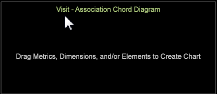

# 関連付けの弦のビジュアライゼーション{#association-chord-visualization}

関連付けの弦のビジュアライゼーションを使用すると、指標、ディメンションおよびエレメント間の比率と関連付けの両方を示せます。弦が大きいほど強い関連付けを表します。

関連付けテーブルは、[相関行列](/help/home/c-get-started/c-analysis-vis/c-correlation-analysis/c-correlation-analysis.md)および[クロス集計の弦](/help/home/c-get-started/c-analysis-vis/associations-visualization.md)のビジュアライゼーションで使用されるピアソン相関係数ではなく、クラメールの V 係数を使用して値を比較します（相関行列とクロス集計の弦で比較できるのは指標だけですが、関連付けテーブルと関連付けの弦では指標、ディメンションおよびエレメントを比較できます）。関連付けの弦は、以前に作成した[関連付けテーブル](../../../home/c-get-started/c-analysis-vis/associations-visualization.md#concept-9d937dda38174875b32095c6eaf22f2f)の別の表示も提供します。

**関連付けの弦を作成するには**

1. ワークスペース内で、**ビジュアライゼーション／予測分析／関連付けの弦**&#x200B;を右クリックします。

   リストから拡張ディメンションを選択できるメニューが表示されます。

   

   選択すると、空の関連付けテーブルが開き、選択したディメンションがタイトルに表示されます。 

1. **指標、ディメンションまたはディメンションエレメントを選択します**。

   弦のビジュアライゼーションを右クリックし、「**指標を追加**」または「**ディメンションを追加**」を選択します。メニューからアイテムを選択して弦に追加します。

   You can also drag metrics and dimensions from the **[!UICONTROL Finder]** by clicking **[!UICONTROL Ctrl-Alt]** and dragging metrics and dimensions to the chord. または、開いているテーブルから弦のビジュアライゼーションにディメンションエレメントを直接ドラッグします。

1. **関連付ける追加の指標、ディメンションおよびエレメントを選択します**。

   2 つ以上の値を選択すると、グラフが自動的に更新され、関連付けデータの表示が開始されます。必要に応じて、データポイントを関連付ける指標の追加を続けます。

   

   弦のビジュアライゼーションでは、全体に対する各セグメントの比率が面積によって表されます。重要な関係を特定および調査するために必要な指標、ディメンションまたはエレメントの追加を続けます。

1. **弦のビジュアライゼーションを表示します**。

   ビジュアライゼーション内の各値の上にカーソルを置くと、関係が表示されます。

1. **設定を変更します。**&#x200B;弦のビジュアライゼーションを右クリックすると、指標、ディメンションまたはエレメントを変更したり、絶対数または割合としてディメンションを表示したり、選択した指標またはすべての指標を削除したり、色と詳細を編集したり、値を関連付けテーブルにエクスポートしたりするためのメニューが表示されます。

**関連付けテーブルから関連付けの弦を作成するには**

1. **関連付けテーブル**&#x200B;のビジュアライゼーションを開きます。
1. 右クリックして「**弦のビジュアライゼーションを書き出し**」を選択します。関連付けの弦の図が開き、関連付けテーブルで選択した値が表示されます。 

>[!IMPORTANT]
>
>1つ以上の指標を含む関連付けの弦の図から関連付けテーブルを書き出すと、関連付けテーブルの行/列に要素が重複して表示されます。 エレメントが複製されないようにするには、関連付けの弦の図からエレメントをエクスポートするのではなく、新しい関連付けテーブルを作製し、エレメントを追加します。

