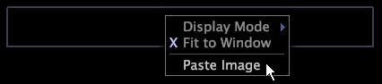

# 画像注釈{#image-annotations}

画像注釈を使用して、任意のソースから画像をコピーし、ワークスペースに直接貼り付けられます。

その後、サイズを変更したり、カラースキームを反転させたり、画像を暗くしたりできます。

## 画像の追加 {#section-bcb71217e75f4135a90a222b27479c9a}

1. Copy any image to your clipboard by right-clicking the image and clicking **[!UICONTROL Copy]**.
1. Right-click within the image annotation and click **[!UICONTROL Paste Image]**.

>[!NOTE]
>
>画像注釈に追加できる画像は1つだけです。 新しい画像を注釈に貼り付けると、既存の画像の上に貼り付けられます。複数の画像をワークスペースに追加するには、別の画像注釈を追加する必要があります。

## 画像のサイズ変更 {#section-c8136a2573bf4378a9aa18cc6a098b27}

* クリックしながら注釈の枠または角をドラッグします。

## 画像の反転 {#section-6248ca0f729f4397ac200fae0eef9d9a}

* 注釈内で右クリックし、「>」または「>」 **[!UICONTROL Display Mode]** をク **[!UICONTROL Invert (white to black)]** リック **[!UICONTROL Display Mode]** します **[!UICONTROL Invert (black to white)]**。

## 画像のグレー表示 {#section-2d4b66428ea4456e9735c0ad09f3b765}

* 注釈内で右クリックし、「>」または「>」 **[!UICONTROL Display Mode]** をク **[!UICONTROL Dim]** リック **[!UICONTROL Display Mode]** します **[!UICONTROL Very Dim]**。

## Return to original display mode {#section-044fad7278bd4947b463deca1b94acfd}

* 注釈内で右クリックし、「>」をクリッ **[!UICONTROL Display Mode]** クしま **[!UICONTROL Original]**&#x200B;す。

## Fit to window {#section-904eb9aed20947749bc35525efeb4bda}

**「ウィンドウに合わせる」オプションを有効または無効にするには**

The [!DNL Fit to Window] option, when selected, lets the annotation automatically expand or shrink to fit the image size. このオプシ [!DNL Fit to Window] ョンは、デフォルトで有効になっています。

* 注釈内で右クリックします **[!UICONTROL Fit to Window]**。 When enabled, an X appears to the left of [!DNL Fit to Window].

