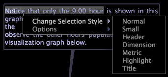

# テキスト注釈{#text-annotations}

{{eol}}

テキスト注釈は、任意のテキストを入力して、ワークスペースに説明的な情報またはコメントを追加できるウィンドウです。

テキスト注釈は、他のタイプのビジュアライゼーションと同様に、ワークスペース内で移動したり、操作したりします。テキストの外観を書式設定したり、ワークスペースに追加するテキスト注釈に名前を付けたり、編集または保存を行ったりできます。テキスト注釈は、Microsoft Excel に書き出して、次の方法で生成および配布することもできます。 [!DNL Report].

詳しくは、 [!DNL Reports]を参照し、 *Insight レポートガイド*.

## テキストを追加または編集 {#section-8ecc44e0eeb24c5990050102013c0aed}

* テキストの本文内でクリックして編集モードに入り、入力を開始します。

   >[!NOTE]
   >
   >テキスト注釈は、切り取り (Ctrl+x)、コピー (Ctrl+c)、貼り付け (Ctrl+v)、元に戻す (Ctrl+z)、やり直し (Ctrl+Shift+z)、セクションを選択（クリック+ドラッグ）、すべてを選択 (Ctrl+a) など、基本的な編集機能をサポートします。 詳しくは、 [Windows でのテキストの操作](../../../../home/c-get-started/c-wk-win-wksp/c-work-text-win.md#concept-f1222434bf954767808e94b955945c8d).

## 段落に書式を適用する {#section-27744c1589134aa3918aa8787429c0dc}

1. テキストの本文内で、書式設定する段落を右クリックします。
1. クリック **[!UICONTROL Change Paragraph Style]** > *&lt;**[!UICONTROL text style]**>*.

## 選択範囲への書式設定の適用 {#section-4032ecbcc0064e5c96504c15b6f481bf}

1. テキストの本文内で、クリックしながらドラッグして、書式設定するテキストを選択します。
1. 選択範囲を右クリックし、 **[!UICONTROL Change Selection Style]** > *&lt;**[!UICONTROL text style]**>*.

## 折り返し設定を変更する {#section-56948687d47349fc8ba21e108fd13cc1}

このオプションは、注釈内のテキストをワークスペースのビジュアライゼーションの端で折り返すかどうかと、その折り返し方を制御します。

* テキストの本文内で右クリックし、 **[!UICONTROL Options]** > **[!UICONTROL Word Wrap]**&#x200B;を選択し、次に目的のオプションをクリックします。

   * **なし：**&#x200B;このオプションを選択すると、この注釈の折り返しが解除されます。
   * **両サイド：**&#x200B;このオプションを選択すると、注釈内のテキストはワークスペースのビジュアライゼーションの両サイドで折り返します。
   * **最適なサイド：**&#x200B;このオプションを選択すると、注釈内のテキストはワークスペースのビジュアライゼーションの片方のサイドでのみ折り返します。

## 列設定の変更 {#section-5cd3f3d63cf64119a2fcec371e33b734}

このオプションは、注釈でテキストを表示する列の数を制御します。

* テキストの本文内で右クリックし、 **[!UICONTROL Options]** > **[!UICONTROL Columns]**&#x200B;を選択し、次に目的のオプションをクリックします。

   * **自動：**&#x200B;このオプションでは、幅とテキストの長さに対して最も適切な列レイアウトが選択されます。
   * **1 ～ 4：**&#x200B;これらのオプションでは、1 列、2 列、3 列または 4 列でテキストを表示できます。

## Microsoft Excel へのエクスポート {#section-b239057b822348849fd17a83c3a03c22}

ウィンドウのエクスポートの詳細については、 [ウィンドウデータのエクスポート](../../../../home/c-get-started/c-wk-win-wksp/c-exp-win-data.md#concept-8df61d64ed434cc5a499023c44197349).
