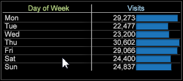
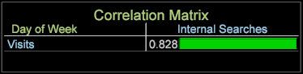

# 相関行列{#correlation-matrix}

統計的相関では、高度なデータマイニングにより、意味のある関係を測定して、機会を特定します。

Employing the [Pearsons correlation coefficient](../../../../home/c-get-started/c-analysis-vis/c-correlation-analysis/c-correlation-pearsons.md#concept-5996cb8c89fd4df5b47b7318e7a1d29c), the Correlation Matrix furnishes you with relevant information to better identify the next steps in a marketing campaign, to improve site design, or to continue in-depth customer analysis for additional correlation dependencies.

## 相関行列の作成 {#section-87ed12ccc1af4196a1b6534e621c4cbb}

相関行列では、可算または非可算ディメンションに対して指標を比較します。その後、行列を変更して、色の選択によってビジュアライゼーション内の相関関係を強調したり、テキストマップ、ヒートマップまたはその両方としてレンダリングしたりできます。

1. 相関行列を開きます。

   Right-click [!DNL Visualization] > [!DNL Predictive Analytics] > [!DNL Correlation Matrix]. ディメンションテーブルが開きます。

   

   Select a dimension, such as [!DNL Time] > [!DNL Day of the Week] from this menu. 相関テーブルが開き、行列の隅にディメンションが表示され、行と列に関連する指標が配置されます。For the Day of the Week dimension, **[!UICONTROL Visits]** is the associated metric.

   

   指標をその指標自体と比較しているので、相関関係は 1.000 です（完全だが使用できない相関関係を表しています）。

1. 指標の 1 つを変更します。

   Right-click and select **[!UICONTROL Change Metric]** to change a metric in either the row or column. これにより、2 つの指標の値の相関関係が設定されます。

   For this example, change the **[!UICONTROL Visits]** metric in the column to **[!UICONTROL Internal Searches]**. 右クリックし、// [!DNL Metric] >を [!DNL Custom Events] 選択し [!DNL Custom Event 1-10] ます [!DNL Internal Searches]。

   

1. 相関行列に複数の指標を追加します。

   指標の列または行を右クリックします。例えば、指標メニューから、 [!DNL Metric] > [!DNL Custom Events] > [!DNL Custom Event 1-10] > [!DNL Sign in Error].

   

   新しい指標が相関値と共に列に表示されます。You can add other metrics, such as **[!UICONTROL Email Signups]**, to build out the table.

   

   または、列の指標と比較する指標を行に追加します。

   

1. （オプション）ディメンションエレメントを追加して、指標を制限します。

   Right-click in the workspace and select **[!UICONTROL Table]**. 開いているディメンションテーブルで、Ctrl + Alt キーを押しながらエレメントを列または行の指標の上にドラッグします。エレメントがブラケットに囲まれて指標の横に表示されます。

   For example, for the **[!UICONTROL Visits]** metric, you can constrain it by selecting the **[!UICONTROL Country]** as **[!UICONTROL New Zealand]**.

   

   ディメンションエレメントを選択すると、選択したディメンションエレメントに基づいてすべての指標の相関関係が変更されることに注意してください。ディメンションウィンドウを閉じると、訪問回数指標だけが「New Zealand（ニュージーランド）」に制約されるようになります。

   >[!NOTE]
   >
   >If changing a metric with a dimension constraint (by right-clicking and selecting **[!UICONTROL Change Metric]**), the dimension element constraining the metric will be lost. その場合は、ディメンションエレメントを再度追加する必要があります。

1. 指標をさらに制限する[バイナリフィルター](../../../../home/c-get-started/c-analysis-vis/c-correlation-analysis/c-correlation-binary-filter.md#concept-24e1daff43c540f69019f236976da31c)を作成します。テーブル内の指標を右クリックし、メニューから「バイナリフィルター」を選択します。

## 相関関係の計画と分析の目的 {#section-cc322da60b7e417ba29e72b0afeb6f79}

相関行列を作成する一般的な目的は、次のとおりです。

**指定されたディメンションに対して 2 つの指標の関係を特定します**。この例では、相関行列はコアディメンションである曜日を中心に作成され、訪問回数、電子メールのサインアップ、サインインエラー指標を、内部検索、ログイン、表示された調査という指標イベントに対して比較しています。

**仮説を立てて、分析に集中します**。相関分析を実行したら、次は、指標の依存関係と相関関係を探します。例えば、内部検索が電子メールのサインアップに影響があることがわかれば、その関係を予測し、マーケティングキャンペーンや Web サイトのナビゲーションデザインを変更するといった対策を取ることができます。

**より高度なデータマイニングアルゴリズムが含まれている指標を特定します**。ほとんどの場合、重要な指標は、複数の相関関係に影響していることで特定されます。そうした重要な指標を選択し、追加のデータマイニング分析に適用して、より深く把握することができます。

## 相関行列機能の注意点 {#section-ef3626c665ea468a9ecdad624b4132f5}

**テーブル内のディメンションエレメントをフィルターおよび選択して、値のように比較します**。例えば、曜日ディメンションを使用していて、曜日ディメンションテーブル内の特定の曜日をクリックするなど、コアディメンションの要素をクリックすると、使用可能な相関がない、1 対 1 の一致が 100 ％で描画されます。ルートディメンションが曜日なので、曜日ディメンションテーブル内で選択すると、行列は 1 対 1 の相関に変更されます。

ただし、（すべてのエレメントから 1 つ選択した場合の）1 対 1 の相関関係はその特定の日に限られます。複数選択した場合は、必ずしも 1 対 1 の相関関係が残らず、選択した曜日が 1 つでも、1 つ以上でも、100％の一致がレンダリングされるとは限りません。

**統計的相関は、相関するデータモデルとは異なります**（Adobe Analytics 製品の過去の参照）。Data Workbench の統計的相関は、[ピアソン相関モデル](../../../../home/c-get-started/c-analysis-vis/c-correlation-analysis/c-correlation-pearsons.md#concept-5996cb8c89fd4df5b47b7318e7a1d29c)に基づいています。

**散布グラフで相関を表示します**。Right click the title on a Scatter Plot and choose [!DNL Display Correlation] from the [!DNL Visualization] menu. 相関値が散布グラフの右上のセクションに表示されます。

>[!NOTE]
>
>アプリケーションがピアソン相関計算を実行できない場合、散布グラフとピアソンのマトリックスに「計算エラー」が表示されます。 これは、通常、データ不足により、0 で除算しようとする式が原因です。
