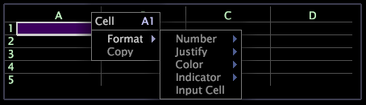

# ワークシート内のデータの操作{#work-with-data-in-worksheets}

ワークシートの任意のセルにテキストまたは式を入力できます。

[!DNL eval( )]を使用しない限り、ワークシート内のすべての式の前に等号(=)が付きます。この記号は、参照先のセル内のテキストを式として扱います。

指標、ディメンション、フィルターの構文ルールの完全なリストについては、[クエリー言語構文](../../../home/c-get-started/c-qry-lang-syntx/c-qry-lang-syntx.md#concept-15d1d3f5164a47d49468c5acb7299d9f)を参照してください。

**ワークシートにデータを入力するには**

1. スプレッドシート内のセルを 2 回クリックして、編集モードに入ります。選択したセルがハイライトされます。
1. 目的のデータをセルに入力または貼り付けます。

**セル間でコピーして貼り付けるには**

1. コピーするデータを含むセルを右クリックし、「**[!UICONTROL Copy]**」をクリックします。
1. コピーしたデータを貼り付けるセルを右クリックし、「**[!UICONTROL Paste]**」をクリックします。

Data Workbenchは、適切な列と行を参照するように、新しいセルの参照を自動的に更新します。

**セルのグループ間でコピーして貼り付けるには**

1. コピーするデータを含む複数のセルを選択します。
1. コピーするデータを含むセルを右クリックし、「**[!UICONTROL Copy]**」をクリックします。
1. コピーしたデータの貼り付けを開始する最初のセルを右クリックし、「**[!UICONTROL Paste]**」をクリックします。 データが先頭セルおよびその下に貼り付けられます。

Data Workbenchは、適切な列と行を参照するように、新しいセルの参照を自動的に更新します。

**列を挿入するには**

* 列を右クリックし、「**[!UICONTROL Insert Column]**」をクリックします。 新しい列が選択した列の左側に挿入されます。

**列を削除するには**

* 削除する列を右クリックし、「**[!UICONTROL Delete Column]**」をクリックします。 列が削除されます。

**行を挿入するには**

* 行を右クリックし、「**[!UICONTROL Insert Row]**」をクリックします。 新しい行が選択した行の上に挿入されます。

**行を削除するには**

* 削除する行を右クリックし、「**[!UICONTROL Delete Row]**」をクリックします。 行が削除されます。

**列のサイズを変更するには**

1. 列のヘッダー行で、サイズを変更する列の右側の分割線の上にマウスカーソルを合わせます。
1. クリックして、列の幅を広くするには右側にドラッグし、列の幅を狭くするには左側にドラッグします。

**セルを書式設定するには**

1. セルを右クリックし、**[!UICONTROL Format]**&#x200B;をクリックします。

   

1. 以下の使用可能なオプションのメニューから目的の書式をクリックします。

<table id="table_5788E01E52CC44E7927A0D23760D9EDD"> 
 <thead> 
  <tr> 
   <th colname="col1" class="entry"> メニューオプション </th> 
   <th colname="col2" class="entry"> 説明 </th> 
  </tr>
 </thead>
 <tbody> 
  <tr> 
   <td colname="col1"> 
数値 
 </td> 
   <td colname="col2"> 
時刻、日付、パーセンテージ、小数など、選択した数値書式をデータに適用します。 
 
選択した書式を削除するには、「デフォルト」をクリックします。 
 </td> 
  </tr> 
  <tr> 
   <td colname="col1"> 
均等配置 
 </td> 
   <td colname="col2"> 
セル内のデータを左、中央または右に均等配置します。デフォルトは左揃えです。 
 
選択した書式を削除するには、「デフォルト」をクリックします。 
 </td> 
  </tr> 
  <tr> 
   <td colname="col1"> 
Color 
 </td> 
   <td colname="col2"> 
選択したフォント色をセル内のデータに適用します。デフォルトのフォント色は白です。 
 
選択した書式を削除するには、「デフォルト」をクリックします。 
 </td> 
  </tr> 
  <tr> 
   <td colname="col1"> 
インジケーター 
 </td> 
   <td colname="col2"> 
このセルを使用して指標インジケーターを作成します。詳しくは、「 <a href="../../../home/c-get-started/c-analysis-vis/c-wksts/c-metric-ind.md#concept-f0e911b23b2c4e8da3e1ea7b9ae04183"> 指標インジケーターの作成</a>. 
 
選択した書式を削除するには、「デフォルト」をクリックします。 
 </td> 
  </tr> 
  <tr> 
   <td colname="col1"> 
入力セル 
 </td> 
   <td colname="col2"> 
選択したセルを入力セルにします。詳しくは、「 <a href="../../../home/c-get-started/c-analysis-vis/c-wksts/c-input-cells.md#concept-08cd2c05a28a43dd9f7698b37e23e590"> 入力セルの作成</a>. 
 
選択した書式を削除するには、「デフォルト」をクリックします。 
 </td> 
  </tr> 
 </tbody> 
</table>

## キーボードショートカット {#section-05301f4d2c60418e86902635a7aeee20}

ワークシート内で、メモ帳や Microsoft Word などのテキストエディターで使用できる、多数の基本的な編集キーボードショートカットが使用可能です。

以下の表に、ワークシートへのデータ入力時に使用できる基本的なキーボードショートカットを示します。

<table id="table_8E6F73F253B3451CA1DE45EE4F4E69EF"> 
 <thead> 
  <tr> 
   <th colname="col1" class="entry"> ショートカット </th> 
   <th colname="col2" class="entry"> 説明 </th> 
  </tr> 
 </thead>
 <tbody> 
  <tr> 
   <td colname="col1"> 
矢印キー 
 </td> 
   <td colname="col2"> 
上、下、左、右の矢印キーを使用して、ワークシート内でセル間を移動します。 
 </td> 
  </tr> 
  <tr> 
   <td colname="col1"> 
F2 
 </td> 
   <td colname="col2"> 
選択したセル内にカーソルを配置して、セルを編集します。 
 </td> 
  </tr> 
  <tr> 
   <td colname="col1"> 
Enter 
 </td> 
   <td colname="col2"> 
選択したセルの編集を完了します。カーソルはそのセルから削除され、セルの内容に編集が反映されます。 
 </td> 
  </tr> 
  <tr> 
   <td colname="col1"> 
Esc 
 </td> 
   <td colname="col2"> 
選択したセルの編集をキャンセルします。カーソルはそのセルから削除され、セルの内容が編集開始前の内容に戻されます。 
 </td> 
  </tr> 
  <tr> 
   <td colname="col1"> 
削除 
 </td> 
   <td colname="col2"> 
セルの内容を削除します。 
 </td> 
  </tr> 
  <tr> 
   <td colname="col1"> 
Ctrl + A 
 </td> 
   <td colname="col2"> 
セルの内容を選択します。 
 </td> 
  </tr> 
  <tr> 
   <td colname="col1"> 
Ctrl + c 
 </td> 
   <td colname="col2"> 
セルの内容をコピーします。 
 </td> 
  </tr> 
  <tr> 
   <td colname="col1"> 
Ctrl + x 
 
Shift + Delete 
 </td> 
   <td colname="col2"> 
セルの内容をコピーして削除します。 
 </td> 
  </tr> 
  <tr> 
   <td colname="col1"> 
Ctrl + v 
 
Shift + Insert 
 </td> 
   <td colname="col2"> 
コピーしたセルの内容を選択したセルに貼り付けます。 
 </td> 
  </tr> 
  <tr> 
   <td colname="col1"> 
Ctrl + z 
 </td> 
   <td colname="col2"> 
入力を取り消します。 
 </td> 
  </tr> 
  <tr> 
   <td colname="col1"> 
Ctrl + Shift + z 
 </td> 
   <td colname="col2"> 
入力をやり直します。 
 </td> 
  </tr> 
 </tbody> 
</table>
