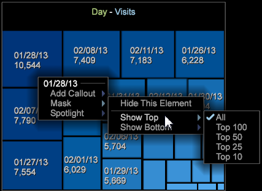

# 密度マップ{#density-map}

密度マップビジュアライゼーションは、四角形のマップ内にエレメントを影付きの長方形として表示します。

長方形のサイズはエレメントの値によって異なります。値が大きいほど、大きい面積の長方形で表されます。円グラフと同様に、このビジュアライゼーションを使用すると、選択したディメンションの中で最も大きな割合を占めているエレメントをすぐに確認することができます。

密度マップを作成するには：

1. 新しいワークスペースを開きます。

   新しいワークスペースを開いた後に、**追加**／**一時的にロック解除**&#x200B;をクリックする必要がある場合があります。
1. クリック **[!UICONTROL Visualization]** > **[!UICONTROL Density Map]**.

1. メニューから&#x200B;**[!UICONTROL Dimension]**&#x200B;を選択します。

   例えば、**[!UICONTROL Time]** > **[!UICONTROL Days]**&#x200B;を選択します。

   一方、**[!UICONTROL Time]**/**[!UICONTROL Hours]**&#x200B;を選択すると、より小さい値を持つ要素がより多く表示され、小さい長方形として表示されます。

   >[!NOTE]
   >
   >必要に応じて複数のエレメントを持つディメンションを選択する必要があります。 現在、ディメンションごとのエレメント数は最大 200 個に制限されています。

1. **[!UICONTROL Visualization]** > **[!UICONTROL Table]**&#x200B;を開き、テーブルからマップに表示する要素を選択して、表示をディメンションを変更できます。

   

   マップは、テーブルからの選択に応じて変更されます。

1. 小さなエレメントの上にカーソルを置くと、マウスカーソルの近くに表示されるテキスト内にそのエレメントの名前と値が表示されます。
1. 右クリックし&#x200B;**[!UICONTROL Mask]**&#x200B;を選択して要素をマスクし、オプションを選択します。

   

   マスクされたすべてのノードを表示するには、**[!UICONTROL Unhide All]**&#x200B;を選択します。

1. 右クリックして&#x200B;**[!UICONTROL Spotlight]**&#x200B;を選択し、要素をスポットライトしてから、オプションを選択します。 スポットライトを使用すると、範囲内のエレメントに明暗を付けることができます。
1. ワークスペースに色凡例を追加します。色凡例を使用して、マップ内の値を識別することができます。

   ワークスペースに色凡例を追加できます。ノードの色は、データの追加のディメンションに基づいて変更されます。
1. マップのタイトルを右クリックし、メニューから選択して、ディメンションまたは指標を変更します。

   

1. 引き出し線を追加表示するには、セルを右クリックし、「**[!UICONTROL Add Callout]**」を選択します。 メニューから様々なタイプやビジュアライゼーションを選択できます。

   

1. すべてのビジュアライゼーション内で同様に、タイトルバーの上を右クリックして、「閉じる」、「保存」、「Excel にエクスポート」、「注文」、「コピー」、「最小化」および枠のないビジュアライゼーションを表示する「枠なし」という基本コマンドを使用できます。

   

1. 密度マップでは、他のビジュアライゼーションと同様に、複数のエレメントを選択および選択解除できます。

* エレメントを選択するには、左クリックします。
* 複数のエレメントを選択するには、Ctrl キーを押しながらクリックします。
* エレメントを選択解除するには、Shift キーを押しながらクリックします。
* メニューを開くには、選択したエレメント内で右クリックします。次に、**[!UICONTROL Deselect]**&#x200B;または&#x200B;**[!UICONTROL Deselect All]**&#x200B;を選択して、選択した要素をクリアします。

## 追加のオプション {#section-d77defb012424de4a7ced8e5c93115bc}

密度マップを右クリックすると、メニューが開き、次のオプションが表示されます。

<table id="table_3ADA85031C834792BFD041E186962A41"> 
 <thead> 
  <tr> 
   <th colname="col1" class="entry"> オプション </th> 
   <th colname="col2" class="entry"> 説明 </th> 
  </tr>
 </thead>
 <tbody> 
  <tr> 
   <td colname="col1"> 追加 引き出し線 </td> 
   <td colname="col2">エレメントをさらに識別または説明するために、ビジュアライゼーションに引き出し線としてテキストやグラフィックを追加します。 
また、密度マップで選択されているエレメントに基づいて、空の指標の凡例、テーブル、折れ線グラフまたは散布グラフを選択することもできます。その後、必要に応じて、これらの空のビジュアライゼーションに指標やディメンションを追加できます。 
 </td> 
  </tr> 
  <tr> 
   <td colname="col1"> マスク </td> 
   <td colname="col2">マスクオプションを使用すると、選択したエレメントを非表示にできます。右クリックすると、マスクオプションが表示されます。 
この要素を非表示：選択した 1 つのエレメントをマスクする場合は、このオプションを選択します。 
 
選択項目を非表示：選択した複数のエレメントをマスクする場合は、このオプションを選択します。 
 
上位を表示：密度マップで値に基づいて上位 100、50、25 または 10 個のエレメントのみを表示する場合は、このオプションを選択します。 
 
下位を表示：密度マップで値に基づいて下位 100、50、25 または 10 個のエレメントのみを表示する場合は、このオプションを選択します。 
 </td> 
  </tr> 
  <tr> 
   <td colname="col1"> スポットライト </td> 
   <td colname="col2"> スポットライトを使用すると、範囲内のエレメントに明暗を付けることができます。右クリックすると、メニューが開き、次のオプションが表示されます。 
上位を表示：密度マップで値に基づいて上位 100、50、25 または 10 個のエレメントのみを強調表示する場合は、このオプションを選択します。 
 
下位を表示：密度マップで値に基づいて下位 100、50、25 または 10 個のエレメントのみを強調表示する場合は、このオプションを選択します。 
 </td> 
  </tr> 
  <tr> 
   <td colname="col1"> 
選択を解除 
 
すべて選択解除 
 </td> 
   <td colname="col2"> 
 現在のエレメント（選択されている場合）を解除する場合、または選択されているすべてのエレメントを選択解除する場合は、これらのコマンドを選択します。 
 </td> 
  </tr> 
 </tbody> 
</table>
