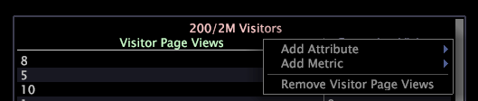

# 詳細テーブル{#detail-table}

{{eol}}

詳細テーブルを使用すると、他のビジュアライゼーション内に作成した選択範囲により定義されるデータのサブセットに関する追加情報を表示できます。

表示される追加情報は、すべての利用可能データをサンプリングしたものです。

以下の表は、詳細テーブルの要素について説明したものです。

<table id="table_C88C7F7F5AEA4820B908923E45CC0A62"> 
 <thead> 
  <tr> 
   <th colname="col1" class="entry"> 要素 </th> 
   <th colname="col02" class="entry"> Color </th> 
   <th colname="col2" class="entry"> 説明 </th> 
  </tr> 
 </thead>
 <tbody> 
  <tr> 
   <td colname="col1"> 
レベル 
 </td> 
   <td colname="col02"> 
ピンク 
 </td> 
   <td colname="col2"> 
詳細な属性および指標の情報を表示する可算ディメンション。レベルの前には、利用可能な要素数に対して表示される要素数が付きます。例えば、6/444 は、444 の利用可能な要素のうち 6 つの要素が表示されるということを示しています。上記の例で、Visitors というレベルは、表示される詳細のすべてが訪問者に基づいているということを示します。Page Views というレベルは、表示される詳細のすべてがページビューに基づいているということを示します。複数のレベルを同時に表示することは、様々な可算の親を持つデータを分析する場合に役立ちます。 
 </td> 
  </tr> 
  <tr> 
   <td colname="col1"> 
属性 
 </td> 
   <td colname="col02"> 
緑 
 </td> 
   <td colname="col2"> 
City 対 Visitors など、レベルと 1 対多または 1 対 1 のディメンション。各行には、選択したレベルの各要素に関連付けられた要素が表示されます。上記の例で、Domain 属性と City 属性には、各サンプル訪問者のドメインと都市がリストされます。 
 </td> 
  </tr> 
  <tr> 
   <td colname="col1"> 
指標 
 </td> 
   <td colname="col02"> 
青 
 </td> 
   <td colname="col2"> 
選択したレベルに関する指標の詳細。レベルが Visitors に設定されている上記の例で、Page Views 指標には個々の訪問者のページビュー数が表示され、Page Views レベルには各ページビューの詳細が表示されます。 
 </td> 
  </tr> 
 </tbody> 
</table>

Web サイトデータを扱っていて、特定の都市または特定のドメインからの訪問者が特定の期間に訪問したページを識別したいとします。

まず、関心がある期間を表示するビジュアライゼーションを作成してから、その期間を選択する必要があります。これで、データセット内のサンプル人数分の訪問者に関する目的のデータを表示する詳細テーブルを追加できます。

上述の詳細を表示するには、以下の手順を実行する必要があります。

1. 詳細テーブル内で右クリックし、 **[!UICONTROL Add Level]** > **[!UICONTROL Visitor]**.
1. 詳細テーブル内で右クリックし、 **[!UICONTROL Add Level]** > **[!UICONTROL Page View]**.
1. を右クリックします。 **[!UICONTROL Visitors]** レベルの見出しをクリックし、 **[!UICONTROL Add Attribute]** > **[!UICONTROL Geography]** > **[!UICONTROL Domain]**.
1. 訪問者レベルの見出し内で右クリックし、 **[!UICONTROL Add Attribute]** > **[!UICONTROL Geography]** > **[!UICONTROL City]**.
1. 訪問者レベルの見出し内で右クリックし、 **[!UICONTROL Add Metric]** > **[!UICONTROL Page Views]**.
1. ページビュー数レベルの見出し内で右クリックし、 **[!UICONTROL Add Attribute]** > **[!UICONTROL Page]** > **[!UICONTROL Page]**.

次のワークスペースの例は、指定した期間中のサイトへの訪問者をランダムサンプリングした 6 人の訪問者に関連する詳細を示しています。

## レベルを追加 {#section-f948d3361fd84906ac4d9ebce520bfd0}

* 詳細テーブル内で右クリックし、 **[!UICONTROL Add Level]** > *&lt;**[!UICONTROL dimension name]**>*.

## レベルの削除 {#section-a8c820e0b656451e98e5ea75373edefc}

* 既存のレベルの見出しを右クリックし、 **[!UICONTROL Remove Level]** > *&lt;**[!UICONTROL dimension name]**>*.

## 属性と指標の追加 {#section-cdda2df3c9a448d5b9770686c8b8efb3}

* 属性または指標の見出しを右クリックし、 **[!UICONTROL Add Attribute]** > *&lt;**[!UICONTROL attribute name]**>* または **[!UICONTROL Add Metric]** > *&lt;**[!UICONTROL metric name]**>*.

## 属性と指標を削除する {#section-4002ac957a2846678f9940270987d651}

* 削除する列を右クリックし、 **[!UICONTROL Remove Attribute]** > *&lt;**[!UICONTROL attribute name]**>* または **[!UICONTROL Remove Metric]** > *&lt;**[!UICONTROL metric name]**>*.

## Microsoft Excel へのエクスポート {#section-a9eaba63c88a4598836a34669ba8cac1}

ウィンドウのエクスポートの詳細については、 [ウィンドウデータのエクスポート](../../../home/c-get-started/c-wk-win-wksp/c-exp-win-data.md#concept-8df61d64ed434cc5a499023c44197349).
