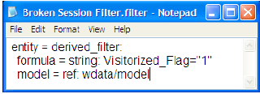

# フィルターファイルの手動編集{#edit-filter-files-manually}

.filter ファイルを手動で編集する手順です。

1. [!DNL Profile Manager]で&#x200B;**[!UICONTROL Filters]**&#x200B;をクリックし、編集するファイルを見つけます。
1. ファイルがサーバー上にある場合は、フィルター名の横の該当する列のチェックマークを右クリックし、**[!UICONTROL Make Local]**&#x200B;をクリックします。
1. [!DNL User]列のフィルターのチェックマークを右クリックし、**[!UICONTROL Open]**/**[!UICONTROL in Notepad]**&#x200B;をクリックします。 [!DNL .filter]ファイルが開きます。

   

1. 必要に応じてファイルを編集します。フィルターを定義する際に使用する構文については、「[フィルター式の構文](../../../../home/c-get-started/c-qry-lang-syntx/c-syntx-fltr-exp.md#concept-72f2563f809747a2a3cff7ec72462a15)」を参照してください。
