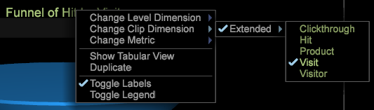

# ファンネルの構築{#building-a-funnel}

新しいファンネルビジュアライゼーションを構築するには、次の手順を実行します。

<!--  -->

1. 新しいワークスペースで、ディメンションテーブルを開きます。

   

   For example, right-click on the workspace and select **[!UICONTROL Table > Site Content > Page Name]**

1. ファネルのビジュアライゼーションが開きます。

   For example, right-click on the workspace and select **[!UICONTROL Visualization > Funnel]**.

   

1. Add a dimension by selecting the element, then drag while then holding **[!UICONTROL `<Ctrl>`]** + **[!UICONTROL `<Alt>`]**.

1. 要素をターゲットゾーンの上の位置にドラッグしま **[!UICONTROL Drag Dimension Element Here]**&#x200B;す。

   

1. 追加のディメンションを追加します。

   ファンネルには、合計 8 個の手順を追加できます。
1. 選択したテーブルを解放して、オーディエンス全体に基づいてファンネルを表示します。

   ファンネルビジュアライゼーションでは、他のすべてのビジュアライゼーションのパターンに従っており、選択されたエレメントによって、視覚化しているデータのセグメントを制御できます。
1. ファンネルクリップディメンション、レベルディメンションおよび指標を変更します。

   タイトルを右クリックして、カスタムプロファイルで定義されている指標とディメンションに基づいてこれらのオプションを調整します。

   

ファンネルからは、フォールアウト率とフォールスルー率、顧客の販売コンバージョンの割合、キャンペーンやコンテンツパスに従っている割合を特定できます。詳しくは、[パスブラウザー](../../../../home/c-get-started/c-analysis-vis/c-funnel-visualization/c-path-browser-funnel.md#concept-b0cedf7a28ae422696ded1258c9a4119)を開くと、選択したページに到着する前に表示していたページの詳細なリストと、ページを離れた後のパスを表示できます。

その他のファネル機 [能を参照してくださ](../../../../home/c-get-started/c-analysis-vis/c-funnel-visualization/c-funnel-visualization-features.md#concept-e65c81fe17794acd8d00d796b1780dc3)い。
