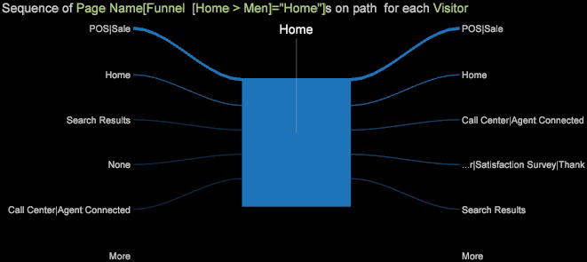

# パスブラウザーの追加{#adding-a-path-browser}

{{eol}}

ファンネルビジュアライゼーションから、パスブラウザーを開いて、さらに詳細な訪問者のフォールアウトとフォールスルーのパスを特定できます。

<!--  -->

訪問者が「フォールアウト」した（パスを離れた）場所や訪問者が「フォールスルー」した（パスに従った）場所を特定できます。フォールアウトの矢印またはフォールスルーのコーンを選択することで、同じファンネルビジュアライゼーションから複数のパスブラウザーを開くことができます。

1. フォールアウトした訪問者（特定の手順のときにサイトを離れた訪問者）のパスブラウザーを開きます。フォールアウトの矢印を右クリックし、「パスブラウザーを追加」オプションを選択します。

   

   パスブラウザーでは、ファンネルで選択したエレメントに訪問者が到達する前にアクセスした場所（左側）と、ページを離れた後に移動した場所（右側）を確認できます。

   

   パスブラウザーでは、選択したディメンションに出入りする線の幅がトラフィックの量を示しています。例えば、Men のページに到達する前に、他の経路で来た訪問者はわずかで、ほとんどは Home ページから移動しています。また、離れた後は、ほとんどが Men Surfing ページに移動しています。

1. 「フォールスルー」訪問者のパスブラウザーを開きます。ファンネルでコーンを右クリックし、フォールスルー（ファンネルの次の手順に移動）した訪問者のパスを特定します。
1. パスブラウザーの下部にある「**次より多い**」ボタンをクリックすると、テーブルが開き、以前と現在のすべての訪問が表形式ビューで表示されます。

   
