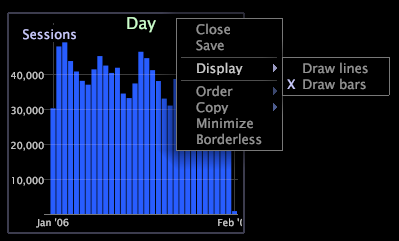

# グラフ表示の変更{#change-a-graph-display}

デフォルトでは、グラフのビジュアライゼーションにはバーが表示されますが、バーを折れ線として表示したり、折れ線をバーとして表示することもできます。

以下の例に両方の表示タイプを示します。

**表示タイプを選択するには**

グラフの下部にあるディメンションラベルを右クリックし、**[!UICONTROL Display]** > **[!UICONTROL Draw lines]**&#x200B;または&#x200B;**[!UICONTROL Display]** > **[!UICONTROL Draw bars]**&#x200B;をクリックします。 有効な表示モードの左側には X が表示されます。

**グラフ上のグラデーションオーバーレイ**

右クリックして、メニューから&#x200B;**グラデーションオーバーレイ**&#x200B;を選択すると、グラフエレメントを見やすくできます。

* **グラデーションオーバーレイなし**。グラデーションオーバーレイを適用せずにバーを表示します。
* **左からの背景**：すべてのバーを左から右へのカラーグラデーションで表示します。
* **右からの背景**：すべてのバーを右から左へのカラーグラデーションで表示します。
* **円柱**：各バーをバーの中心からバーの端へのカラーグラデーションで表示します。
