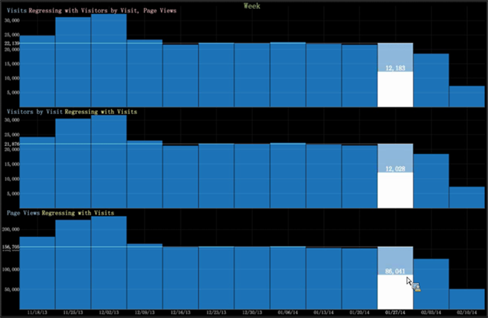

# 回帰分析グラフ{#regression-analysis-graph}

Data Workbench の棒グラフには、複数のグラフにまたがる複数の指標の回帰比較が含まれるようになりました。

Data Workbench の[棒グラフ](https://experienceleague.adobe.com/docs/data-workbench/using/client/analysis-visualizations/graphs/c-graphs.html)では、1 つのグラフの指標をもう 1 つのグラフの指標に回帰できます。複数のグラフがある場合は、指標（従属変数として）を他の指標を評価するグラフ（独立変数として）と比較できます。これにより、1 つの従属変数（最初に作成された指標）と他の変化する一連の指標（作成された従属指標を使用した回帰）との間の関係の強さを確認できます。

グラフのビジュアライゼーションで回帰分析を行うと、アナリストは「what-if」シナリオを実行できます（例：訪問回数がこのレベルに増加した場合に、その増加が売上高にどのような影響をもたらすか？）。

**回帰分析の設定**

1. 回帰比較の従属指標としてグラフを選択します。

   グラフ上で右クリックし、「**回帰のベース指標として設定**」を選択します。

   

1. 独立変数として他の指標のグラフを設定します。

   指標を右クリックし、他の指標を表示するには&#x200B;**[!UICONTROL Regress with `<base metric name>`]**&#x200B;を選択します。

   

1. グラフ上で右クリックして棒を上下に移動して、回帰を表示します。

   グラフ上で特定の値を右クリックすると、上昇または下降値に基づいた各指標の回帰率を表示できます。

   

   例えば、ページビュー数が 86,041 に減少する場合、他の指標である訪問回数は 12,183、訪問別の訪問者数は 12,028 になります。

   

   訪問別の訪問者数の値が 26,141 に増加する場合、他の指標である訪問回数は 26,560、ページビュー数は 189,091 になります。
