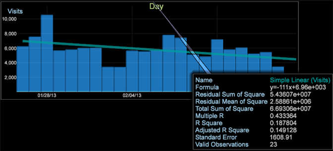

# トレンドライン{#trend-lines}

トレンドラインを使用すると、グラフを重ねて、データを比較および解釈できます。

[散布グラフ](https://experienceleague.adobe.com/docs/data-workbench/using/client/analysis-visualizations/c-scat-plots.html)ビジュアライゼーションと同様に、グラフビジュアライゼーションでトレンドラインを設定して、線形回帰、指数回帰、累乗回帰または多項式回帰ラインに基づいた変化率を表示できるようになりました。トレンドライン機能を使用すると、通常は時間ディメンションに対して、トレンドラインをグラフの上に重ねることができます。

例えば、次のグラフの比較では、訪問回数が増加傾向であるのに対し、注文件数は減少傾向にあることがわかります。

トレンドラインを追加するには

1. グラフを開き、左上隅にある指標名を右クリックします。
1. **[!UICONTROL Trend Lines]**&#x200B;をクリックし、オプションから「 」を選択します。

   

   グラフ上に表示するトレンドラインは、**単回帰**、**指数回帰**、**累乗回帰**&#x200B;または&#x200B;**多項式回帰**&#x200B;から選択できます。多項式回帰では、多項式回帰トレンドラインが作成されます。単回帰では、変化率が回帰直線に従うものとしてトレンドラインが作成されます。指数回帰では y = b*exp( *x ) として、累乗回帰では y = b*x`a`a としてトレンドラインが計算されます。

   トレンドが計算されてグラフ上にレンダリングされ、コールアウトが開き、トレンド式の詳細情報が表示されます。

   
