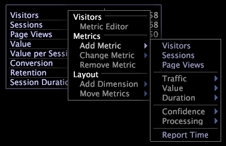

# Metric legends{#metric-legends}

指標の凡例を使用すると、プロファイルに関連するベースライン指標と、データセット（作成されている場合は現在の選択範囲）に関連する統計を表示できます。

Adobe アプリケーションの指標の凡例には、以下の [!DNL Site] の指標の凡例と同様に、データセットに関連する指標が表示されます。

指標の凡例は、実際にはテーブルのビジュアライゼーションの特殊ケースです。そのため、テーブルに使用できる機能と同じ機能を指標の凡例に使用できます。「 [テーブル](../../../../home/c-get-started/c-analysis-vis/c-tables/c-tables.md#concept-c632cb8ad9724f90ac5c294d52ae667f).

## 指標の追加 {#section-6655470bf06c4d2b82f7a01784552d1e}

* In the metric legend, right-click a metric name and click **[!UICONTROL Add Metric]** > *&lt;**[!UICONTROL metric name]**>*.

## 指標の削除 {#section-c0da3396b2d44b9b899b7a0e7d747d94}

* In the metric legend, right-click the name of the metric that you want to remove and click **[!UICONTROL Remove]**.

## Microsoft Excelにエクスポート {#section-03b07062fb43422c902ff65cb66bbd27}

ウィンドウの書き出しの詳細については、「ウィンドウデータの書き [出し」を参照してくださ](../../../../home/c-get-started/c-wk-win-wksp/c-exp-win-data.md#concept-8df61d64ed434cc5a499023c44197349)い。

## Export to a TSV file {#section-51a0a6f9cd05448caf149ddc927aa665}

ウィンドウの書き出しの詳細については、「ウィンドウデータの書き [出し」を参照してくださ](../../../../home/c-get-started/c-wk-win-wksp/c-exp-win-data.md#concept-8df61d64ed434cc5a499023c44197349)い。
