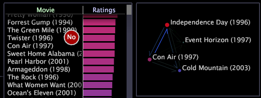

# プロセスマップの作成{#create-a-process-map}

{{eol}}

棒グラフ、テーブル、階層ビューから空白のマップに要素をドラッグアンドドロップすることにより、2D プロセスマップや 3D プロセスマップを作成できます。

追加できる要素は、プロセスマップのベースディメンションの要素でなければなりません。同じベースディメンションを使用していれば、1 つのプロセスマップから別のプロセスマップにノードをドラッグアンドドロップすることもできます。さらに、マップ全体をズームまたは移動して特定のノードにフォーカスしたり、他のビジュアライゼーションタイプに変更したりできます。「[ビジュアライゼーションへのズーム](../../../../home/c-get-started/c-vis/c-zoom-vis.md#concept-7e33670bb5344f78a316f1a84cc20530)」を参照してください。

**テーブルまたは棒グラフを使用してプロセスマップに要素を追加するには**

* プロセスマップと同じベースディメンションを持つ任意のテーブルまたは棒グラフから、Ctrl + Alt キーを押しながら個々の要素をクリックして、プロセスマップにドラッグします。マウスがプロセスマップに達するまで、マウスカーソルには「No」という語が表示されます。

   >[!NOTE]
   >
   >追加できる要素は、プロセスマップのベースディメンションの要素でなければなりません。

   

**階層ビューを使用してプロセスマップに要素を追加するには**

>[!NOTE]
>
>Adobeでは、分析する階層の最上位レベルのノードを追加することをお勧めします。

1. プロセスマップと同じベース次元を持つ任意のテーブルまたは棒グラフから、ベース次元の要素またはラベルを右クリックし、 **[!UICONTROL Hierarchy View]**.
1. Ctrl + Alt キーを押しながら、要素をクリックしてプロセスマップにドラッグします。マウスがプロセスマップに達するまで、マウスカーソルには「No」という語が表示されます。

   >[!NOTE]
   >
   >追加できる要素は、プロセスマップのベースディメンションの要素でなければなりません。

   1 つの要素をプロセスマップにドラッグすると、その要素のみに対して 1 つのマップノードが作成されますが、複数の要素（グループ）または複数の要素を含むフォルダーを選択して階層からドラッグすると、そのグループまたはフォルダーに対して 1 つのノードが作成されます。例えば、Web サイトのデータを扱う場合、 [!DNL site.com/cgi-bin] をマップ上に置くと、 [!DNL site.com/cgi-bin/*]：そのフォルダーの子であるすべてのページとディレクトリを表します。

ページ階層ビューについて詳しくは、 [階層ビューの適用](../../../../home/c-get-started/c-analysis-vis/c-tables/c-hier-vews.md#concept-b461183424a841eb94f8143a0eaf9bff).

**別のプロセスマップからノードをプロセスマップに追加するには**

>[!NOTE]
>
>プロセスマップには同じベースディメンションが必要です。

* 以下の方法を使用して、最初のプロセスマップから 2 つ目のプロセスマップにノードをコピーします。

   * 個々のノードをコピーするには、ノードごとにクリックし、2 つ目のプロセスマップにドラッグします。
   * 複数のノードをコピーするには、Ctrl キーを押しながらクリックしてドラッグし、コピーするノードの周囲にボックスを作成します。次に、ボックスをクリックして、ハイライトされているノードを 2 つ目のプロセスマップにドラッグします。ハイライトされているノードがすべて 2 つ目のプロセスマップにコピーされます。
