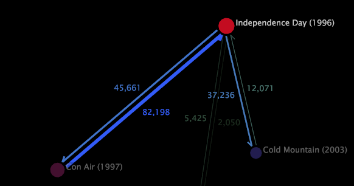

# 指標の数量の表示{#display-a-metric-quantity}

2D プロセスマップには、マップ上のノードへのアクティビティまたはノードからのアクティビティの量を表す指標の数量を表示できます。

アクティビティの実際のシーケンスには、このマップに追加されていないノードが含まれている場合があります。この数量は、割合、絶対値または値なしとして表されます。

>[!NOTE]
>
>指標の数量は2Dプロセスマップに対してのみ表示できます。

**指標の数量を 2D プロセスマップに表示するには**

* 目的のノードをクリックします。プロセスマップ内のその他すべてのノードが暗くなり、ハイライトされているノードと関連付けられている指標の数量の間の矢印が見やすくなります。

**数量の表示方法を選択するには**

1. Right-click a node and click **[!UICONTROL Options]** > **[!UICONTROL Quantify Links]**.
1. Click **[!UICONTROL Percentage]**, **[!UICONTROL Absolute Value]**, or **[!UICONTROL Off]**.

   

以下の例は、2 つの 2D プロセスマップに指標の数量を表示したものです。

