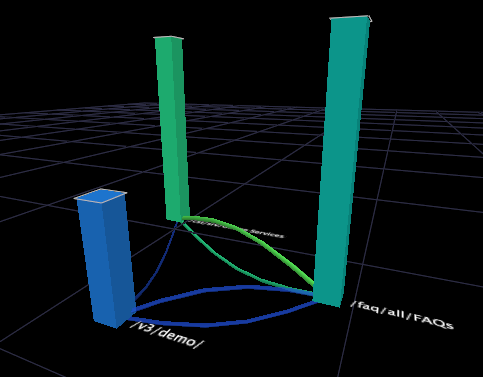

# プロセスマップのタイプ{#types-of-process-maps}

プロセスマップの様々なタイプに関する情報です。

## 2Dプロセスマップ{#section-ea7fbdb80b1b44aebcd9e4090b6540bf}

2 次元のプロセスマップは、ディメンション要素間のアクティビティを 2 次元で表示します。2D プロセスマップのノードのサイズは、そのノードに関連付けられた指標の値に比例します。さらに、2 つのノード間の矢印の太さと濃さは、それらのノードの指標の値の平均に比例します。

2D プロセスマップ内では、次のタスクを実行できます。

* ノードの選択、移動、削除およびラベル付け
* 選択の実行
* ディメンションの保存
* 他のビジュアライゼーションの作成
* リンクの色のアクティブ化
* 指標量の表示
* 引き出し線の追加

次の例の 2D プロセスマップでは、映画の名前に対応するノードを表示しています。各映画の名前は、Movie ディメンションの要素であり、これらは映画のデータから成るデータセットに定義されています。Movie ディメンションは、このプロセスマップのベースディメンションです。

この例では、各ノードのサイズおよび各矢印の太さと濃さが、Ratings 指標に比例しています。この Ratings 指標は、映画が受けた評価の総数です。したがって、『*Independence Day*』のようにノードの大きい映画は、『*Event Horizon*』のようにノードの小さい映画よりも評価が高いことを示しています。また、『*Cold Mountain*』の前に『*Independence Day*』を評価した映画視聴者は、同じ映画を逆の順序で評価した人よりも多いことがわかります。なお、矢印は、視聴者が『*Independence Day*』を評価した直後に『*Cold Mountain*』を評価したことを示すわけではありません。逆向きの矢印も同じです。間に他の映画を評価している場合がありますが、そのような映画はこのマップには表示されません。

## 2D指標マップ{#section-a9b846fc71224058918fbc378315effe}

2 次元の指標マップは、特定の指標の値に基づいてノードを配置する 2D プロセスマップの一種です。ほとんど場合、2D 指標マップで使用される指標は、コンバージョンまたは定着です。コンバージョンマップと定着マップは、対顧客チャネルのプロセスの中で顧客コンバージョンと定着に影響するステップの理解に役立ちます。

>[!NOTE]
>
>2D指標マップで使用する指標は、割合で表す必要があります。

コンバージョン指標マップでは、コンバージョンが 0 ％のノードがグラフの左に描画され、コンバージョンが 100 ％のページは右に描画されます。ノード間のアクティビティが表示され、プロセス内のどのステップがコンバージョンの増減につながり、どのステップが離脱を促進してしまうかが簡単にわかります。プロセス-コンバージョン分析は、プロセスの比較や、同じプロセスの異なる実装の比較に効果的な方法です。

同様に、定着マップでは、定着が 0 ％の要素がグラフの左に、定着が 100 ％の要素は右に表示されます。マップ上で各ノードの定着率がわかります。これにより、顧客のリピートに影響する要素を判断できます。

>[!NOTE]
>
>2D指標マップ上のノードを水平に移動することはできません。 指標マップは、指標の値に基づいて左から右にノードを配置するように設計されています。

## 3Dプロセスマップ{#section-80acb63ea0994af1af7faef3c6264e51}

3 次元のプロセスマップは、ディメンション要素間のアクティビティを 3 次元で表示します。3D プロセスマップの棒の高さは、そのノードに関連付けられた指標の値に比例します。2D プロセスマップと同様に、2 つのノード間のコネクタの太さと濃さは、それらのノードの指標の値の平均に比例します。3D プロセスマップ内では、次のタスクを実行できます。

* ノードの選択、移動、削除およびラベル付け
* 選択の実行
* ディメンションの保存
* 他のビジュアライゼーションの作成
* リンクの色のアクティブ化

次の例の 3D プロセスマップでは、Web サイトのページに対応するノードを表示しています。各ページは、Page ディメンションの要素であり、これらは Web トラフィックデータから成るデータセットに定義されています。Page ディメンションは、このプロセスマップのベースディメンションです。

この例では、各棒の高さおよび各コネクタの太さと濃さが、Sessions 指標に比例しています。この Sessions 指標は、ページが表示されたセッションの数です。したがって、/faq/all/FAQs のように棒が高いページは、/vs/demo のように棒が低いページよりも多くのセッションで表示されたことがわかります。なお、2 つのページの間のコネクタは、特定のセッション中に、一方のページが表示された直前または直後に他方のページが表示されたことを示すわけではありません。同じセッション中に他のページが表示されている場合がありますが、そのようなページはこのマップに表示されません。
