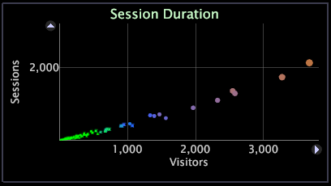

# 2D scatter plots{#d-scatter-plots}

散布グラフは、データディメンションの要素（Page（ページ）や City（都市）など）を、x 軸と y 軸が異なる指標を表すグリッド上にグラフとして描いたものです。

本質的に異なる多数の項目の関係を把握しようとする場合、2 つの異なる指標を使う散布グラフが役に立つ場合があります。次の例の散布グラフでは、各都市を訪問者の数とそれぞれの定着率で示しています。

散布グラフにより、外れ値がすぐにわかります。例えば、Salt Lake City の訪問者あたりの定着率は平均より高いことがわかります。

散布グラフを使用してデータの一貫性を示すこともできます。次の例の散布グラフでは、セッションが特定の長さである訪問者の数を示しています。

散布グラフ上の各ポイントのサイズは、半径指標で決まります。デフォルトの半径指標は、Adobe アプリケーションごとに異なります。例えば、[!DNL Site] では半径指標がデフォルトでセッションに基づいています。半径指標を変更して、利用できる任意の指標を散布グラフのポイントで表せます。これを行う手順については、「[半径指標の変更](../../../home/c-get-started/c-analysis-vis/c-scat-plots.md#section-fd80576d583c430cb469daf12e39aa2a)」を参照してください。ポイントの色は、ワークスペース内で開く色凡例に基づきます。色凡例について詳しくは、「[色凡例](../../../home/c-get-started/c-analysis-vis/c-legends/c-color-leg.md#concept-f84d51dc0d6547f981d0642fc2d01358)」を参照してください。

## 点を選択 {#section-4b4d45f39b884d54bb7407b3b2f4ea50}

**単一のポイントを選択するには**

* ポイントをクリックします。

**別のポイントまたはポイントのグループを選択に追加するには**

* Ctrl キーを押しながらポイントをクリックするか、Ctrl キーを押しながら複数のポイント全体をドラッグします。

**ポイントまたはポイントのグループを選択から削除するには**

* Shift キーを押しながらポイントをクリックするか、Shift キーを押しながら複数のポイント全体をドラッグします。

## Changing dimensions {#section-796cd962ef3f476caa89d99083782ed1}

* Right-click the label of the dimension at the top of the graph and click **[!UICONTROL Change Dimension]** > *&lt;**[!UICONTROL dimension name]**>*.

## Changing metrics {#section-44b8be9215cd4039b1eeb98ae1b31445}

**散布グラフの x 軸または y 軸に表示される指標を変更するには**

* Right-click the label of the metric that you want to change and click **[!UICONTROL Change Metric]** > *&lt;**[!UICONTROL metric name]**>*.

## Changing radius metrics {#section-fd80576d583c430cb469daf12e39aa2a}

**散布グラフの半径指標を変更するには**

Right-click the label of the dimension at the top of the graph and click **[!UICONTROL Change Radius Metric]** > *&lt;**[!UICONTROL metric name]**>*.

