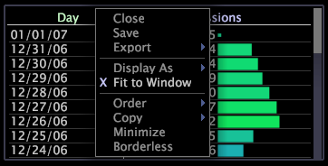

# ウィンドウへのデータの適合化{#fit-data-to-a-window}

「ウィンドウに合わせる」オプションを使用すると、ウィンドウのサイズを変更するたびに、テーブルのデータ列が自動的に拡大または縮小されます。

[!DNL Fit to Window]が無効な場合、データ列は手動でサイズ変更する必要があります。

**「ウィンドウに合わせる」オプションを有効または無効にするには**

* ビジュアライゼーションの上の枠を右クリックし、「**[!UICONTROL Fit to Window]**」をクリックします。

   

有効にすると、[!DNL Fit to Window]の左側にXが表示されます。

**データ列を手動でサイズ変更するには**

* （上軸領域で）2 つのデータ列を分割している線をクリックし、目的の幅までドラッグします。

   
