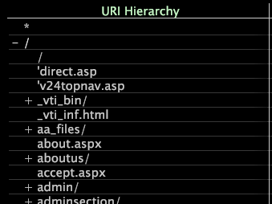

# 階層ビューの適用{#apply-hierarchy-views}

{{eol}}

階層ビューは、Site または HBX アプリケーションを使用している場合にのみ表示可能です。

階層ビューでは、Web サイト内のページがファイル名で階層的にまとめられ、アルファベット順に並べ替えられて表示されます。階層ビューは分析に役立ちますが、プロセスマップなどの高度なビジュアライゼーションの設定にも使用できます。プロセスマップについて詳しくは、「 [プロセスマップ](../../../../home/c-get-started/c-analysis-vis/c-proc-maps/c-proc-maps.md#concept-880aee224404429785b733a4e80d275e).

>[!NOTE]
>
>データセットがクラスター内の複数のサーバーで実行するように設定されている場合、この機能を正しく機能させるには、システム管理者が、どのマシンが中央の正規化サーバーとして機能するかを指定する必要があります。 指定する手順については、『*データセット設定ガイド*』の「ログ処理設定ファイル」の章を参照してください。

**階層ビューを有効または無効にするには**

* 任意のページまたは URI ビジュアライゼーションから、ページディメンションの要素またはラベルを右クリックし、 **[!UICONTROL Hierarchy View]**.

   

   オプションの横には、 [!DNL hierarchy view] はアクティブです。

   階層は、ツリー構造を使用して Web サイトのセクションとページにまとめられます。セクション（ノード）は、セクション名の横の+記号または — 記号を使用して展開または縮小できます。 個々のページの横には+記号や — 記号は表示されません。

   

## 階層ビューでのディメンション要素のマスク {#section-e477c469934846da8d807f92fc2f3ed1}

マスクとは、データのサブセットまたはディメンション内の要素のサブセットを選択することです。分析に含めたくない要素をマスクまたは非表示にします。の使用 [!DNL Mask] 階層ビューのメニューオプションでは、要素をビジュアライゼーションに表示する必要がある指標の最小割合を選択します。

**を使用してデータをマスクするには [!DNL Mask] メニューオプション**

1. ディメンションの要素またはラベルを右クリックし、 **[!UICONTROL Mask]**.

   

1. 「次の値より大きい」で適切な割合をクリックしてから、マスクする指標をクリックします。

例えば、0.1 ％をクリックしてから Page Views をクリックした場合、ページビューの総数の 0.1 ％以下の要素はマスクされ（非表示）、ページビューの総数の 0.1 ％を上回る要素が表示されます。0 ％をクリックした場合は、選択した指標に対して 0（ゼロ）の値を持つすべての要素がマスクされます。
