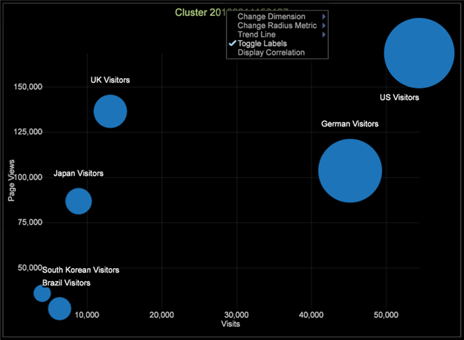

# クラスターの調査{#exploring-clusters}

構築したクラスターディメンションは、クラスターエクスプローラーを使用して、保存することや、調査することができます。

1. ビジュアライゼーション／予測分析／クラスタリング／クラスターエクスプローラー／クラスターを選択します。調査する保存済みのクラスターディメンションを選択します。

   

1. ビジュアライゼーションのタイトルを右クリックし、「ラベルを切り替え」をクリックして、ラベルを有効にします。このメニューを使用して、調査するクラスターディメンションの変更、半径指標の変更、トレンドラインの追加および相関関係の表示を行うことができます。

   

1. 調査するクラスターディメンションを変更するには、このメニューを使用して、半径指標を変更し、トレンドラインを追加して、相関関係を表示します。

   

   クラスターエクスプローラーには、一度に 2 つの入力軸に沿ってクラスターの中心が表示されます。そのため、多時間空間における中心の分離を調べることができます。

1. クラスターを右クリックして、メニューを表示し、引き出し線のタイプ（画像、テキスト注釈、指標の凡例、テーブル、折れ線グラフまたは散布グラフ）を選択します。

   
