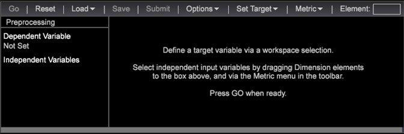

# 傾向スコアリングの設定{#setting-up-propensity-scoring}

傾向スコアリングビジュアライゼーションを使用するには、この手順に従います。

1. 新しいワークスペースを開き、/// **[!UICONTROL Add]** をク **[!UICONTROL Visualization]** リッ **[!UICONTROL Predictive Analytics]** クし **[!UICONTROL Scoring]** ます **[!UICONTROL Propensity Score]**。

   

1. Set the **[!UICONTROL Target]** (the dependent variable).

   従属変数を設定するには、次を選択します。

* **ディメンション**:ワークスペース内で右クリックし、を選択しま **[!UICONTROL Table]**&#x200B;す。 次に、従属変数としてディメンションエレメントを選択します。

   OR

* **[!UICONTROL Filter Editor]**&#x200B;をインストールします。//をク **[!UICONTROL Add]** リック **[!UICONTROL Visualization]** して、フ **[!UICONTROL Filter Editor]** ィルターエディターのビジュアライゼーションを開きます。

   

   After selecting a Dimension element or Filter as the dependent variable, click **[!UICONTROL Set Target]**, enter a name to describe the dependent variable. 「**[!UICONTROL OK]**」をクリックして（フィルターボックスが強調表示されていることを確認し）ターゲットを設定します。

   

   ターゲットに付けた名前が左側のペインに表示される従属変数の名前になります。
1. 独立変数を追加します。

   指標またはディメンションエレメントを使用して独立変数を追加します。

   

* **指標**. From the Propensity Scoring toolbar, select a metric from the **[!UICONTROL Metrics]** menu.

* **ディメンション**:ワークスペース内で右クリックし、を選択しま **[!UICONTROL Table]**&#x200B;す。 Select one or more Dimension elements and drag to the left column under **[!UICONTROL Independent Variables]** or to the **[!UICONTROL Element]** box using the `<Ctrl>` + `<Alt>` keys.

1. 設定 **[!UICONTROL Training Filter]**. You can define the set of visitors that you want to score by clicking **[!UICONTROL Options]** > **[!UICONTROL Set Training Filter]** from the Propensity Scoring toolbar. これにより、スコア対象の訪問者のみを使用してデータのサブセットが作成されます。例えば、先月訪問した訪問者、オーストラリア在住の訪問者または特定の製品を見た訪問者を使用できます。

   デフォルトのフィルタ **[!UICONTROL Train on Everyone]**&#x200B;ーはですが、テーブルでアクティブ化す **[!UICONTROL Dimension Elements]** るか、を使用してフィルターを作成することで変更できま **[!UICONTROL Filter Editor]**&#x200B;す。

   ディメンションエレメントを選択するか、フィルターを作成し、アクティブ化したら、**オプション**／**トレーニングフィルターを設定**&#x200B;をクリックし、フィルターを説明する名前を入力し、「**[!UICONTROL OK]**」をクリックします。
1. Once you have identified all your inputs, press **[!UICONTROL Go]**.

   

   スコアリング処理が開始され、データが複数回渡されます。その後、割合を示す線の上に結果が棒グラフとして表示されます。
1. 傾向スコアを保存します。

   6.1 以降では、傾向スコアの保存を使用する際にオプションが表示されるようになりました。

* ディメンション
* ディメンションと指標

   2 つのファイル（ディメンションと定義された指標の両方）を保存できます。

   >[!NOTE]
   >
   >傾向スコアを処理のために送信する場合、ディメンションのみが得られます。

   派生指標は、関連する平均スコア指標です。
1. 正解率を確認します。

   The system will display **[!UICONTROL Model Complete]** and generate a scoring model when the process is complete.

   Right-clicking on **[!UICONTROL Model Complete]** will identify the accuracy of the scoring model as defined by the system. Values ranging from 0 percent to 100 percent will identify the likelihood of the visitors matching the **[!UICONTROL Target]** variable.

   混同行列は、実際のポジティブ（AP）、実際のネガティブ（AN）、予測されたポジティブ （PP）、予測されたネガティブ（PN）の組み合わせによる 4 カウントを付与します。これらの数値は、真の正解とわかっている 20 ％を差し引いた検定データに、結果のスコアリングモデルを適用することで取得されます。スコアが 50％を超える場合、（定義されたイベントに一致する）ポジティブケースとして予測されます。

   

<table id="table_154BDD6D294C4ED1B8C15EC33B74B199"> 
 <tbody> 
  <tr> 
   <td colname="col1"><b>正解率</b> </td> 
   <td colname="col2"> すべての予測から正しい予測を識別することで、モデルの正確さを示します。 
(TP + TN)/(TP + FP + TN + FN) 
 </td> 
  </tr> 
  <tr> 
   <td colname="col1"><b>再現率</b> </td> 
   <td colname="col2"> スコアリングモデルを再度特定する能力を示します。 
<b>TP / (TP + FN)</b> 
 </td> 
  </tr> 
  <tr> 
   <td colname="col1"><b>精度</b> </td> 
   <td colname="col2">矛盾のレベルを示します。 
TP / (TP + FP) 
 </td> 
  </tr> 
 </tbody> 
</table>

1. リフトチャ [ート、ゲインチャート](../../../../home/c-get-started/c-analysis-vis/c-visitor-propensity/c-propensity-gain-lift-chart.md#concept-0d049f6baf534f7fb97f271843ba6c4a)、またはモデルビ [ューアを開きます](../../../../home/c-get-started/c-analysis-vis/c-visitor-propensity/c-propensity-model-viewer.md#concept-9f2593a8218140b7bd132a4c74e159f9)。

   モデル完了ビジュアライゼー **ションを右クリックし** 、「 **[!UICONTROL Lift Chart]**」、「」 **[!UICONTROL Gain Chart]**、「 **[!UICONTROL Model Viewer.]**
