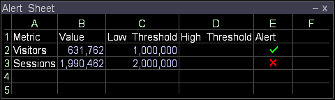

# 指標インジケーターの作成{#create-a-metric-indicator}

ワークシートを使用して、指標が定義済みのしきい値に達したことを示せます。

さらに、[!DNL Report]を使用して、指標が指定期間内に定義されたしきい値に達した場合に、レポートを自動的に生成し、配布することができます。

[!DNL Report]について詳しくは、『*Data Workbenchレポートガイド*』を参照してください。

* [上昇または下降インジケーター](../../../../home/c-get-started/c-analysis-vis/c-wksts/c-metric-ind.md#section-40d7a2c3df0d40d4a7bb1a7e856abcba)
* [チェックインジケーター](../../../../home/c-get-started/c-analysis-vis/c-wksts/c-metric-ind.md#section-98c5298a74f34dcbaaf151549fcc7090)

**ワークシートを使用して指標インジケーターを作成するには**

1. ワークシートのセルの内容を定義します。

   1. 列 A に目的の指標の名前（[!DNL Visitors] など）を入力します。
   1. 列Bに、目的の指標の値（例：[!DNL =Visitors]）を入力します。
   1. 列 C に指標の低しきい値を入力します。
   1. 列 D に指標の高しきい値を入力します。
   1. 列 E に適切な数式を入力します。例については、「[上昇または下降インジケーター](../../../../home/c-get-started/c-analysis-vis/c-wksts/c-metric-ind.md#section-40d7a2c3df0d40d4a7bb1a7e856abcba)」または「[チェックインジケーター](../../../../home/c-get-started/c-analysis-vis/c-wksts/c-metric-ind.md#section-98c5298a74f34dcbaaf151549fcc7090)」を参照してください。
   1. 数式のセル（列E）で右クリックし、**[!UICONTROL Format]** > **[!UICONTROL Indicator]**&#x200B;をクリックして、次のいずれかをクリックします。

      * **[!UICONTROL None]**:指標の代わりに正確な計算をリストします。
      * **[!UICONTROL Check]**:数式に応じて、値が設定したしきい値を上回るか下回っているかを示すために、チェックマークまたはXを使用します。「[チェックインジケーター](../../../../home/c-get-started/c-analysis-vis/c-wksts/c-metric-ind.md#section-98c5298a74f34dcbaaf151549fcc7090)」を参照してください。
      * **[!UICONTROL Up or Down]**:上向き矢印または下向き矢印を使用して、値が低しきい値（下向き矢印）を下回るか、高しきい値（上向き矢印）を上回るか、低しきい値と高しきい値（空白）の間を示します。「[上昇または下降インジケーター](../../../../home/c-get-started/c-analysis-vis/c-wksts/c-metric-ind.md#section-40d7a2c3df0d40d4a7bb1a7e856abcba)」を参照してください。

1. インジケーターを作成する他の指標に対して手順 1 を繰り返します。

作成されたワークシートは、次の例のようになります。

## 上または下のインジケータ{#section-40d7a2c3df0d40d4a7bb1a7e856abcba}

[!DNL Up]または[!DNL Down indicator]には、次の式を使用します。

[!DNL (metric value - low threshold)/(high threshold - low threshold)*2 - 1]

例：[!DNL =(b2-c2)/(d2-c2)*2-1]

この数式を[!DNL Up]または[!DNL Down indicator]と共に使用する場合、各指標には次の3つの結果が考えられます。

* 指標の値が低しきい値と高しきい値の間にある場合、数式は -1 と 1 （これらの値を含まない）の間の数値に評価されます。ワークシートに上向き矢印または下向き矢印は表示されません。
* 指標の値が低しきい値以下の場合、数式は -1 以下の値に評価されます。指標インジケーターが下向き矢印に変わります。
* 指標の値が高しきい値以上の場合、数式は 1 以上の値に評価されます。指標インジケーターが上向き矢印に変わります。

次のワークシートは、数式[!DNL =(b2-c2)/(d2-c2)*2-1]の例を示しています。

## インジケータ{#section-98c5298a74f34dcbaaf151549fcc7090}を確認します

[!DNL Check indicator]には、指標の値が指定したしきい値を超えたとき、または下回ったときに通知を受け取るかどうかを示す数式を使用します。 次に例を示します。

* 値が設定したしきい値を下回ったら通知する場合は、以下の数式を使用できます。

   * [!DNL threshold - metric]

      例：[!DNL =(c2-b2)]

* 値が設定したしきい値を上回ったら通知する場合は、以下の数式を使用できます。

   * [!DNL metric - threshold]

      例：[!DNL =(b3-c3)]

チェックマークが表示される場合、数式は正数に評価されます。X が表示される場合、数式は負数に評価されます。

[!DNL Check indicator]を使用する場合、各指標で考えられる結果は2つあります。

* 指標の値をしきい値より上に保つことが望ましいということを数式が示す場合、指標の値がしきい値以上であればチェックマークが表示され、しきい値未満であれば X が表示されます。
* 指標の値をしきい値より下に保つことが望ましいということを数式が示す場合、指標の値がしきい値以下であればチェックマークが表示され、しきい値より大きければ X が表示されます。

次のワークシートは、式[!DNL =(c2-b2)]と[!DNL =(b3-c3)]の例を示しています。

