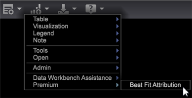

# 最適なアトリビューションの作成{#build-a-best-fit-attribution-model}

プレミアムメニューから最適なアトリビューションを開き、次の手順に従って、最適なアトリビューションモデルを作成します。

[最適なアトリビューション](../../../../home/c-get-started/c-attribution-profiles/c-attrib-algorithmic/c-attrib-algorithmic.md#concept-237feb6e9c4d49efaf75399297dcb9d1)の概要を参照してください。

1. **最適なアトリビューション**&#x200B;を開きます。

   ワークスペースを開き、**[!UICONTROL Premium]** > **[!UICONTROL Best Fit Attribution]**&#x200B;をクリックします。

   

   >[!NOTE]
   >
   >最適なアトリビューションは、Adobe Analytics Premiumの機能で、プロファイルでPremiumを有効にする必要があります。 それには、証明書を更新し、profile.cfg ファイルに Premium プロファイルを追加する必要があります。[DWBサーバーのアップグレードを参照してください。DWB 6.3の場合は6.2～6.3](https://experienceleague.adobe.com/docs/data-workbench/using/install/upgrade-dwb/c-6-2-to-6-3-upgrade.html)。

1. **[!UICONTROL Success]**&#x200B;指標を設定します。

   >[!NOTE]
   >
   >指標は、**[!UICONTROL Finder]**&#x200B;テーブルからアトリビューションビジュアライゼーションの左側のウィンドウにドラッグするか、**入力**&#x200B;メニューから選択します。

   クリック **[!UICONTROL Inputs]** > **[!UICONTROL Set Success]**. 指標メニューが開きます。

   コンバージョンの成功を特定する指標を選択します。

1. （オプション）**売上高**&#x200B;指標を設定します。

   コンバージョンプロセス全体の売上高を評価する指標を設定します。

1. **タッチ**&#x200B;指標を設定します。

   >[!NOTE]
   >
   >タッチ指標の設定は、ディメンション要素をビジュアライゼーションにドラッグして成功指標を自動的に作成しようとする場合にのみ必要です。

   **[!UICONTROL Inputs]**&#x200B;メニューをクリックし、「**タッチを設定**」を選択するか、ファインダーから指標をドラッグします。

   これは、ディメンションエレメントを入力として使用した場合に、チャネル指標を取得するために使用されます。

1. **成功**&#x200B;ウィンドウを設定します。

   「[!DNL Inputs > Success Window]」をクリックします。テーブルから日付範囲を選択し、成功ウィンドウに名前を付けます。**[!UICONTROL Workspace Selection]**&#x200B;をクリックすると、選択した日付が成功指標の時間範囲として割り当てられます。

   

   >[!NOTE]
   >
   >成功ウィンドウはワークステーション選択なので、任意のディメンションを成功ウィンドウに含めることができます。

1. **[!UICONTROL Touch Window]**&#x200B;を設定します。

   「[!DNL Inputs > Touch Window]」をクリックします。テーブルから日付範囲を選択し、タッチウィンドウに名前を付けます。**[!UICONTROL Workspace Selection]**&#x200B;をクリックすると、選択した日付が成功指標の時間範囲として割り当てられます。

   

   デフォルトでは、**タッチ**&#x200B;ウィンドウは&#x200B;**[!UICONTROL Success]**&#x200B;ウィンドウと同じ期間に設定されます。

1. （オプション）トレーニングフィルターを設定します。

   また、ワークスペースで&#x200B;**トレーニングフィルター**&#x200B;を指定して、訪問者のデータをフィルターすることもできます。

   >[!NOTE]
   >
   >成功ウィンドウとタッチウィンドウの両方を設定し、現在のワークスペースの選択にトレーニングフィルターを適用して、データをさらに制限できます。

   

   >[!NOTE]
   >
   >トレーニングセットは、常に、成功ウィンドウを満たす訪問者から取得されます。 フィルターエディターを使用してフィルターすると、成功ウィンドウで報告された訪問者のサブセットを作成することができます。

1. タッチを表すチャネル指標を指定します。

   指標をビジュアライゼーションにドラッグするか、[!DNL Inputs] / [!DNL Add Channel]メニューから選択します。 まだキャンペーンやチャネルに対して指標を定義していないが、チャネルを表すディメンションがある場合は、ビジュアライゼーションでタッチ指標の指定を使用して指標を自動的に作成することができます。

   例えば、タッチ指標を[!DNL Hits]に設定し、[!DNL Email]、[!DNL Press Release]、[!DNL Print Ad]、[!DNL Social Media]などの要素を含む[!DNL dimension]を指定すると、ビジュアライゼーションに要素をドラッグ&amp;ドロップすると、[!DNL Hits where Media Type = Email]形式のチャネル指標が生成されます。[!DNL Media Type]

1. 「**移動**」を押します。

   最適な分析処理が実行され、選択した入力に基づいてチャネルごとにアトリビューションがグラフに表示されます。

   >[!NOTE]
   >
   >完了した分析で「 **モデル完了** 」を右クリックし、アトリビューションモデルの統計を表示します。

   

完了すると、チャネルごとに計算されたアトリビューションモデルと、*売上高*&#x200B;指標の分布（設定されている場合）がグラフに表示されます。モデルは、内部的に保存することや、他のシステムにエクスポートすることができます。

>[!NOTE]
>
>**[!UICONTROL Streaming]**、モー **[!UICONTROL Online]** ドとモ **[!UICONTROL Offline]** ードは、評価対象のデータの待ち時間に基づいてアトリビューションモデルを作成する際に異なる効果を生みます。ストリーミングモードでは、詳細&#x200B;**[!UICONTROL Model Complete]**&#x200B;メッセージが表示されます。 オンラインモードとオフラインモードでは、詳細&#x200B;**[!UICONTROL Local Model Complete]**&#x200B;が表示されます。

## オプションメニュー {#section-22288867f6c8483a8a38410f4b948346}

**オプション**&#x200B;メニューには、最適なアトリビューション分析を設定および表示するための高度な機能が用意されています。

<table id="table_8F6F517B7DBF4259814BEC6D07A72EAC"> 
 <thead> 
  <tr> 
   <th colname="col1" class="entry"> オプションメニュー </th> 
   <th colname="col2" class="entry"> 説明 </th> 
  </tr>
 </thead>
 <tbody> 
  <tr> 
   <td colname="col1">トレーニングフィルターを設定 </td> 
   <td colname="col2"> トレーニングフィルターは、アトリビューションモデルを作成するときに、母集団をフィルターするために成功ウィンドウと組み合わせて使用します。これにより、分析する訪問者のみを含むデータのサブセットが提供されます。 
注意：経験豊富なユーザーは、フィルターを柔軟に活用して、成功ウィンドウとタッチウィンドウのタイムラインを超えて絞り込むことができます。例えば、時間範囲の選択に加えて、一連の<i>参照ドメイン</i>を選択して、それらのドメインからのユーザーのアトリビューションのみを調査できます。 
 </td> 
  </tr> 
  <tr> 
   <td colname="col1">複雑なフィルターの説明を表示 </td> 
   <td colname="col2"> トレーニングフィルター、成功ウィンドウおよびタッチウィンドウのフィルターコードを表示します。 </td> 
  </tr> 
  <tr> 
   <td colname="col1">モデルを保存 </td> 
   <td colname="col2"> 後で使用するために現在のアトリビューションモデルを保存します。 </td> 
  </tr> 
  <tr> 
   <td colname="col1">モデルの読み取り </td> 
   <td colname="col2"> 以前に保存したアトリビューションモデルを開きます。 </td> 
  </tr> 
  <tr> 
   <td colname="col1">プレゼンテーションの表示 </td> 
   <td colname="col2"> プレゼンテーションのために上部のメニューバーを非表示にします。 </td> 
  </tr> 
  <tr> 
   <td colname="col1"> 
<b>オプション／詳細</b>には、トレーニングセットサイズを設定し、クラスのバランスが悪い場合にどうするかを指定するための機能が含まれています。 
 </td> 
   <td colname="col2"> </td> 
  </tr> 
  <tr> 
   <td colname="col1">詳細／トレーニングセットサイズ </td> 
   <td colname="col2"> 
トレーニングセットサイズを設定します。 
 
注意：デフォルトのトレーニングサイズは、大（250,000 人の訪問者用）です。 
 
    <ul id="ul_5F17C60227C34A85A2C476A32F2B5DCD"> 
     <li id="li_A076FC2AD0214ADDBFCFD82AEA5F0880">特小 = 50,000 </li> 
     <li id="li_17E77E01D5374068BEBC80B3AD4CCD41">小 = 75,000 </li> 
     <li id="li_7F6B4834742A4BFCBC3DB214425B88C3">標準 = 100,000 </li> 
     <li id="li_0BB7F791603745028CFC661EBC94D8B4">大 = 250,00 </li> 
     <li id="li_34B60233C84F48F1BCB8040C5195411A">特大 = 500,000 </li> 
    </ul> </td> 
  </tr> 
  <tr> 
   <td colname="col1"><b>詳細／クラスのバランス</b> </td> 
   <td colname="col2"> 
データセットのサイズに基づき、クラスのアンバランスの問題に対して生成する入力レコードの数を特定および定義します。 
 </td> 
  </tr> 
 </tbody> 
</table>

| リセットと削除オプション | 説明 |
|---|---|
| **[!UICONTROL Reset Model]** | **[!UICONTROL Reset]**&#x200B;メニューから&#x200B;**[!UICONTROL Reset Model]**&#x200B;を選択してビジュアライゼーションをクリアしますが、入力指標は維持します。 |
| **[!UICONTROL Reset All]** | **[!UICONTROL Reset]**&#x200B;メニューから&#x200B;**[!UICONTROL Reset All]**&#x200B;を選択して、ビジュアライゼーションと入力指標をクリアします。 |
| **[!UICONTROL Remove]** | 任意の入力を右クリックし、「**[!UICONTROL Remove]**」を選択して、選択した入力から指標をクリアします。 |
| **[!UICONTROL Remove All]** | 「*チャネル*」を右クリックし、「**[!UICONTROL Remove All]**」を選択してすべての入力指標をクリアします。 |
