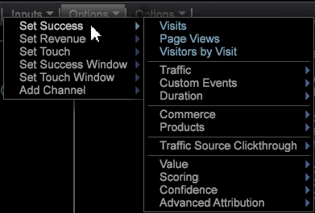

# 最適なアトリビューションの作成{#build-a-best-fit-attribution-model}

プレミアムメニューから最適なアトリビューションを開き、次の手順に従って、最適なアトリビューションモデルを作成します。

最適なアトリビューションの概 [要を参照してくださ](../../../../home/c-get-started/c-attribution-profiles/c-attrib-algorithmic/c-attrib-algorithmic.md#concept-237feb6e9c4d49efaf75399297dcb9d1)い。

1. **最適なアトリビューション**&#x200B;を開きます。

   ワークスペースを開き、/をク **[!UICONTROL Premium]** リックしま **[!UICONTROL Best Fit Attribution]**&#x200B;す。

   

   >[!NOTE]
   >
   >最適なアトリビューションは、プロファイルでPremiumを有効にする必要があるAdobe Analytics Premiumの機能です。 それには、証明書を更新し、profile.cfg ファイルに Premium プロファイルを追加する必要があります。「 [DWB Serverのアップグレード：DWB 6.3の場合は](https://docs.adobe.com/content/help/en/data-workbench/using/install/upgrade-dwb/c-6-2-to-6-3-upgrade.html) 、6.2 ～ 6.3。

1. Set the **[!UICONTROL Success]** metric.

   >[!NOTE]
   >
   >You can either drag a metric from a **[!UICONTROL Finder]** table to the left pane of the Attribution visualization, or select from the **Inputs** menu.

   クリック **[!UICONTROL Inputs]** > **[!UICONTROL Set Success]**. The metric menu will open. 

   コンバージョンの成功を特定する指標を選択します。

1. （オプション）**売上高**&#x200B;指標を設定します。

   コンバージョンプロセス全体の売上高を評価する指標を設定します。

1. **タッチ**&#x200B;指標を設定します。

   >[!NOTE]
   >
   >タッチ指標の設定は、ディメンション要素をビジュアライゼーションにドラッグして成功指標を自動的に作成する場合にのみ必要です。

   Click the **[!UICONTROL Inputs]** menu and select **Set Touch**, or drag a metric from the Finder. 

   これは、ディメンションエレメントを入力として使用した場合に、チャネル指標を取得するために使用されます。

1. **成功**&#x200B;ウィンドウを設定します。

   クリック [!DNL Inputs > Success Window]. テーブルから日付範囲を選択し、成功ウィンドウに名前を付けます。Click **[!UICONTROL Workspace Selection]** and the selected dates will be assigned as the range of time for the Success metric.

   

   >[!NOTE]
   >
   >成功ウィンドウはワークステーションの選択なので、任意のディメンションを成功ウィンドウに含めることができます。

1. を設定しま **[!UICONTROL Touch Window]**&#x200B;す。

   クリック [!DNL Inputs > Touch Window]. テーブルから日付範囲を選択し、タッチウィンドウに名前を付けます。Click **[!UICONTROL Workspace Selection]** and the selected dates will be assigned as the range of time for the Success metric.

   

   By default, the **Touch** window will be set to the same time period as the **[!UICONTROL Success]** window.

1. （オプション）トレーニングフィルターを設定します。

   また、ワークスペースで&#x200B;**トレーニングフィルター**&#x200B;を指定して、訪問者のデータをフィルターすることもできます。

   >[!NOTE]
   >
   >成功ウィンドウとタッチウィンドウの両方を設定する場合、現在のワークスペースの選択範囲にトレーニングフィルターを適用して、データをさらに制限できます。

   

   >[!NOTE]
   >
   >トレーニングセットは常に、成功ウィンドウを満たす訪問者から取得されます。 フィルターエディターを使用してフィルターすると、成功ウィンドウで報告された訪問者のサブセットを作成することができます。

1. タッチを表すチャネル指標を指定します。

   Either drag metrics to the visualization, or choose them from the [!DNL Inputs] > [!DNL Add Channel] menu. まだキャンペーンやチャネルに対して指標を定義していないが、チャネルを表すディメンションがある場合は、ビジュアライゼーションでタッチ指標の指定を使用して指標を自動的に作成することができます。

   For example, with the Touch metric set to [!DNL Hits], and given a [!DNL dimension] called [!DNL Media Type] with elements that include things like [!DNL Email], [!DNL Press Release], [!DNL Print Ad], and [!DNL Social Media], the visualization will generate Channel metrics of the form [!DNL Hits where Media Type = Email] when you drag and drop the element(s) onto the visualization.

1. 「**移動**」を押します。

   最適な分析処理が実行され、選択した入力に基づいてチャネルごとにアトリビューションがグラフに表示されます。

   >[!NOTE]
   >
   >Right-click **Model Complete** on the completed analysis to see statistics for the attribution model.

   

完了すると、チャネルごとに計算されたアトリビューションモデルと、*売上高*&#x200B;指標の分布（設定されている場合）がグラフに表示されます。モデルは、内部的に保存することや、他のシステムにエクスポートすることができます。

>[!NOTE]
>
>**[!UICONTROL Streaming]**、およびモ **[!UICONTROL Online]** ード **[!UICONTROL Offline]** は、評価対象のデータの待ち時間に基づいてアトリビューションモデルを作成する場合に、異なる効果を生み出します。 In Streaming mode, the detail **[!UICONTROL Model Complete]** message will display. オンラインモードとオフラインモードでは、詳細が **[!UICONTROL Local Model Complete]** 表示されます。

## オプションメニュー {#section-22288867f6c8483a8a38410f4b948346}

**オプション**&#x200B;メニューには、最適なアトリビューション分析を設定および表示するための高度な機能が用意されています。

<table id="table_8F6F517B7DBF4259814BEC6D07A72EAC"> 
 <thead> 
  <tr> 
   <th colname="col1" class="entry"> オプションメニュー </th> 
   <th colname="col2" class="entry"> 説明 </th> 
  </tr>
 </thead>
 <tbody> 
  <tr> 
   <td colname="col1">トレーニングフィルターを設定 </td> 
   <td colname="col2"> トレーニングフィルターは、アトリビューションモデルを作成するときに、母集団をフィルターするために成功ウィンドウと組み合わせて使用します。これにより、分析する訪問者のみを含むデータのサブセットが提供されます。 
注意：経験豊富なユーザーは、フィルターを柔軟に活用して、成功ウィンドウとタッチウィンドウのタイムラインを超えて絞り込むことができます。例えば、時間範囲の選択に加えて、一連の<i>参照ドメイン</i>を選択して、それらのドメインからのユーザーのアトリビューションのみを調査できます。 
 </td> 
  </tr> 
  <tr> 
   <td colname="col1">複雑なフィルターの説明を表示 </td> 
   <td colname="col2"> トレーニングフィルター、成功ウィンドウおよびタッチウィンドウのフィルターコードを表示します。 </td> 
  </tr> 
  <tr> 
   <td colname="col1">モデルを保存 </td> 
   <td colname="col2"> 後で使用するために現在のアトリビューションモデルを保存します。 </td> 
  </tr> 
  <tr> 
   <td colname="col1">モデルの読み取り </td> 
   <td colname="col2"> 以前に保存したアトリビューションモデルを開きます。 </td> 
  </tr> 
  <tr> 
   <td colname="col1">プレゼンテーションの表示 </td> 
   <td colname="col2"> プレゼンテーションのために上部のメニューバーを非表示にします。 </td> 
  </tr> 
  <tr> 
   <td colname="col1"> 
<b>オプション／詳細</b>には、トレーニングセットサイズを設定し、クラスのバランスが悪い場合にどうするかを指定するための機能が含まれています。 
 </td> 
   <td colname="col2"> </td> 
  </tr> 
  <tr> 
   <td colname="col1">詳細／トレーニングセットサイズ </td> 
   <td colname="col2"> 
トレーニングセットサイズを設定します。 
 
注意：デフォルトのトレーニングサイズは、大（250,000 人の訪問者用）です。 
 
    <ul id="ul_5F17C60227C34A85A2C476A32F2B5DCD"> 
     <li id="li_A076FC2AD0214ADDBFCFD82AEA5F0880">特小 = 50,000 </li> 
     <li id="li_17E77E01D5374068BEBC80B3AD4CCD41">小 = 75,000 </li> 
     <li id="li_7F6B4834742A4BFCBC3DB214425B88C3">標準 = 100,000 </li> 
     <li id="li_0BB7F791603745028CFC661EBC94D8B4">大 = 250,00 </li> 
     <li id="li_34B60233C84F48F1BCB8040C5195411A">特大 = 500,000 </li> 
    </ul> </td> 
  </tr> 
  <tr> 
   <td colname="col1"><b>詳細／クラスのバランス</b> </td> 
   <td colname="col2"> 
データセットのサイズに基づき、クラスのアンバランスの問題に対して生成する入力レコードの数を特定および定義します。 
 </td> 
  </tr> 
 </tbody> 
</table>

| リセットと削除オプション | 説明 |
|---|---|
| **[!UICONTROL Reset Model]** | From the **[!UICONTROL Reset]** menu, select **[!UICONTROL Reset Model]** to clear the visualization but keep input metrics. |
| **[!UICONTROL Reset All]** | From the **[!UICONTROL Reset]** menu, select **[!UICONTROL Reset All]** to clear the visualization and the input metrics. |
| **[!UICONTROL Remove]** | Right-click on any input and select **[!UICONTROL Remove]** to clear the metric from the selected input. |
| **[!UICONTROL Remove All]** | Right-click on *Channels* and select **[!UICONTROL Remove All]** to clear all input metrics. |

