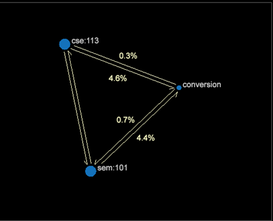

# アトリビューションモデル{#attribution-models}

{{eol}}

顧客マーケティングの遍歴を把握し、定量化するためにアトリビューションプロファイルと組み合わせて使用する 7 つの異なるアトリビューションモデルが用意されています。

**最初と最後の****モデル**

最初のアトリビューションモデルは、従来型の&#x200B;**最初**&#x200B;と&#x200B;**最後**&#x200B;のタッチです。販売をコンバージョンする最初の手順、または商品を精算して購入する前の最後のタッチを把握すると、キャンペーンタイプ（認知の場合は最初のタッチ、コールトゥアクションの場合は最後のタッチ）がわかります。

**均一****モデル**

**均一**&#x200B;の導入により、マーケティングエンゲージメントの表示が拡張されます。すべての適切なマーケティングインタラクションに、それに続く注文とコンバージョンから生成された売上高が均等に割り当てられます。

**スターター、プレイヤーおよびクローザー****モデル**

**スターター、プレイヤーおよびクローザー**&#x200B;モデルは、均一割り当てから進化し、調節可能な重み付けを行う位置ベースの重み付け方式を提供します。分析の実行中に重みを確認することができます。

次の例について考えてみましょう。スターター（または最初）にコンバージョン後の売上高の 30％が割り当てられ、クローザー（または最後）に 30％が割り当てられ、すべてのプレイヤー（それらの中間）が残りの 40％を均等に共有します。

>[!NOTE]
>
>売上高または注文の発生に基づいてマーケティングインタラクションに配分を割り当て直すのは、かなり一般的です。 次の 2 つのモデルでは、成功の他のダイナミクスを明らかにするために、様々な特性をマーケティングインタラクションに結び付けます。

**隣接モデル**

隣接関係モデルは、次の質問に答えて、コンバージョンから離れたマーケティング位置を可視化します。マーケティングチャネルは通常、1`st` （最も近い）、5`th`、または 10`th` マーケティングチャネルのインタラクションが成功から遠ざかっている場合

**待ち時間モデル**

**待ち時間**&#x200B;モデルは、マーケティングチャネルのインタラクションと成功の発生との間の時間のずれを説明するのに役立ちます。これは、認知とコールトゥアクションタイプのキャンペーンを対比して示し、ターゲットオーディエンスからよりタイムリーな反応を得るために実行できる対策を把握するのに役立ちます（ゼロ（0）日という値は、マーケティングインタラクションが成功と同じ日に発生したことを意味します）。

**パスモデル**

パスモデルは、顧客のマーケティングエンゲージメントとコンバージョンの成功を調査し、顧客の遍歴におけるマーケティングインタラクション間の関係を確立するための様々な手法を提供します。プロセスマップを確認することで、サポートするマーケティングチャネルと成功の間の大まかな流れを把握できます。パスブラウザーを使用すると、直接つながりのあるマーケティングインタラクションを評価できます。

パスブラウザービジュアライゼーション

**2D プロセスマップのビジュアライゼーション**

**3D プロセスマップのビジュアライゼーション**

