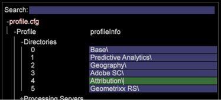

# アトリビューションプロファイルのデプロイ{#deploying-the-attribution-profile}

アトリビューションプロファイルは、継承された、すぐに利用できるプロファイルです。Adobe SC プロファイおよび Analytics（SC／Insight）のデータフィードと組み合わせて、このプロファイルをデプロイすると、複数のデジタルチャネルに新しいアトリビューションモデルを迅速に公開できます。

プライマリサーバーにアトリビューションプロファイルを保存した後、[!DNL Profile] ディレクトリ内の現在のプロファイルにそのプロファイルを統合するために必要な手順が 2 つあります。（1）Profile.cfg ファイルを設定し、（2）必須フィールドを宣言します。

## Profile.cfg ファイルの設定 {#section-7531cb865d994207baba692a6fc842d7}

すべてのプロファイルと同様に、アトリビューションプロファイルは [!DNL profile.cfg] ファイルに追加する必要があります。アトリビューションプロファイルは Adobe SC プロファイルに依存するので、設定ファイルではアトリビューションプロファイルより前に Adobe SC プロファイルをリストする必要があります。

>[!NOTE]
>
>この手順では、データセットの再変換が必要になります。

1. カスタムプロファイルフォルダー内の [!DNL profile.cfg] ファイルを開きます(で開きま [!DNL server\Profiles\(custom profile name)\profile.cfg]す。

1. If the Attribution profile is not listed in the configuration file, add it to the list. 

1. Make sure the **[!UICONTROL Attribution]** string is listed below the **[!UICONTROL Adobe SC]** profile string.

1. 更新した [!DNL profile.cfg] ファイルを保存し、プロファイルマネージャーからサーバーに保存します。

## 必須フィールドの宣言 {#section-23d4273af0c34b7a85ae3430e2c9350e}

アトリビューションプロファイルは、事前に定義されたフィールドを受け取り、一連の変換を行って、拡張されたディメンションを通じて新しい便利な方法でそれらのフィールドを公開します。最も直近の値を提供するため、アトリビューションプロファイルは Adobe SC プロファイルで使用可能なフィールドに依存します。

<table id="table_97751B73CCAA4B96BB162641A178A68A"> 
 <thead> 
  <tr> 
   <th colname="col1" class="entry"> デフォルトの変数 </th> 
   <th colname="col2" class="entry"> フィールド名とデコーダー位置（Adobe SC） </th> 
  </tr>
 </thead>
 <tbody> 
  <tr> 
   <td colname="col1"> キャンペーン </td> 
   <td colname="col2"> <p>x-campaign、#199 </p> </td> 
  </tr> 
  <tr> 
   <td colname="col1"> マーケティングチャネル </td> 
   <td colname="col2"> <p>x-va_closer_detail、#162 </p> <p>x-va_instance_event、#163 </p> </td> 
  </tr> 
  <tr> 
   <td colname="col1"> 注文イベント </td> 
   <td colname="col2"> <p>x-order、#206 </p> <p>x-purchaseid、#200 </p> </td> 
  </tr> 
  <tr> 
   <td colname="col1"> 売上高 </td> 
   <td colname="col2"> x-revenue、#205 </td> 
  </tr> 
  <tr> 
   <td colname="col1"> 単位 </td> 
   <td colname="col2"> <p>x-units、#204 </p> </td> 
  </tr> 
 </tbody> 
</table>

1. Adobe Analytics のデータソースを定義するために使用されるデコーダーグループ内でこれらのフィールドが宣言されていることを確認します。The default decoder group is provided under [!DNL Dataset\Log Procesing\Decoding Instructions.cfg].
1. Verify that these fields are declared in the **[!UICONTROL Fields]** section of the [!DNL SC Fields.cfg] file. This file can be located under [!DNL Dataset\Log Processing\SC Fields.cfg].

## アトリビューションの追加とトラブルシューティング {#section-168133a8a1a54e1281e532033878d246}

The Attribution profile added a configuration file, [!DNL 0a_Marketing Channels.cfg], which copies the value of the [!DNL x-va_closer_detail] into a new field called [!DNL x-marketing-channel], when the [!DNL x-va_instance_event] field matches &quot;1&quot;. Both [!DNL x-va_closer_detail] and [!DNL x-va_instant_event] are decoded by default, and passed from decoding in the installed packages available when you update to version 6.2.

「[!DNL x-marketing-channel]」フィールドは、マーケティングチャネルというシンプルディメンションで使用されます。

>[!IMPORTANT]
>
>If you have altered your profiles by removing previously unused fields that are now being used, you will want to verify that the [!DNL x-va_closer_detail] and [!DNL x-va_instance_event] fields are being decoded and passed through for use.

フィールドが見つからない場合は、詳細な状態を示す次のメッセージが表示されます。

```
<b>x-va_closer_detail</b> is not available
```

 または

```
<b>x-va_instance_event</b> is not available
```

