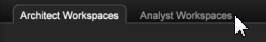
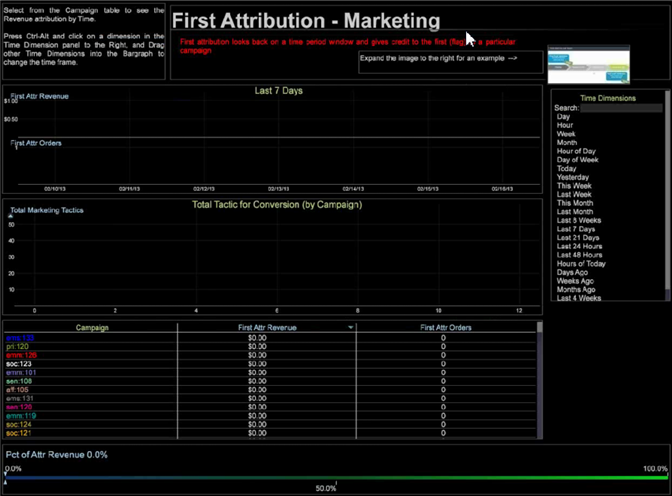

# アトリビューションプロファイル{#attribution-profile}

Data Workbench のルールに基づく新しいアトリビューションプロファイルを使用すると、すばやくアトリビューションイベントを分析し、ユーザーが定義したコンバージョンの成功への貢献度を割り当てることができます。アトリビューションプロファイルには、データアーキテクトがその機能を設定および拡張するために必要な情報がすべて揃っており、アナリストが即座に分析を開始できるように事前に作成されたワークスペースが含まれています。

アトリビューションプロファイルを使用すると、マーケティング活動と成功した顧客のリードジェネレーションや販売コンバージョンの間の関係を新しい視点から捉えることができます。アトリビューションプロファイルは、顧客の遍歴に沿って実現した売上高または参加の有効性を割り当てる必要があるインタラクションを絞り込むのに役立ちます。アトリビューションイベントをすばやく分析して、マーケティング活動とコストの影響を特定し、販売の成功につながった最初や最後のタッチなどのイベントに影響度を割り当てることができます。

<!--  -->

>[!IMPORTANT]
>
>アトリビューションプロファイルは、Analytics(SC/Insight)データフィードを使用するAdobe SCプロファイルを実装したユーザーがすぐに使用できるように設定されます。 デフォルトでは、マーケティングイベントとコンバージョンイベントが、提供されたルールベースモデルで評価されるデフォルトのインタラクションタイプとして使用されます。

詳しくは、「 アトリビューシ [ョンプロファイルとアトリビ](../../../../home/c-get-started/c-attribution-profiles/c-rules-attrib/c-attrib-profile-deploy.md#concept-fbcb5800cd6a40cc901e61f3882988c0) ューションモデルのデプロイ  （英語のみ）を参照してください。

## アーキテクトワークスペースとアナリストワークスペース {#section-27c6aff70ba147cca6e11451e127afb4}

アトリビューションプロファイル内には、ワークベンチの個別のタブで定義されたアーキテクトワークスペースとアナリストワークスペースがあります。

**アーキテクトワークスペース**

Within the **Attribution** tab, click the **[!UICONTROL Architect Workspace]** tab to open workspaces specifically designed to set up your configuration files for basic attribution modeling.

アーキテクトタブには、プロファイルデータセットフォルダー内の各設定ファイルの手順を順番に実行できるワークスペースが含まれています。For example, **[!UICONTROL Attribution Configuration - Step 1]** lets you identify the Attribution values within the Transformation section of the [!DNL profile.cfg] file.

**アナリストワークスペース** ：タブをク **[!UICONTROL Analyst]** リッ **[!UICONTROL Workspaces]** クすると、アトリビューションプロファイルで提供されるディメンションと指標を利用して事前に作成された分析ワークスペースが開きます。

これらのワークスペースは、4 つのカテゴリーに分類されます。

1. **基本レポート**&#x200B;では、ワークスペース内に 1 つのモデルが公開されます。
1. **比較レポート**&#x200B;では、単一のビュー内に複数のモデルを表示することで、分析を拡張します。
1. **調査レポート**&#x200B;では、レポートテンプレートを拡張して、様々な形式でアトリビューションモデルを表示します。また、このセクションでは、位置ベースの重み付けの比率を導入し、公開します。
1. **パスレポート**&#x200B;では、複数のパスビジュアライゼーションを使用して、顧客のマーケティング遍歴を視覚化して、プロセスフローとインタラクションパスを完全に調査および表示できます。

アナリストタブには、レポートを使用して事前設定されたワークスペースが含まれています。例えば、テーブル **[!UICONTROL First Attribution]** から選択して、に基づ **[!UICONTROL Campaign]** くアトリビューションを **[!UICONTROL Revenue]** 表示することができま **[!UICONTROL Time]**&#x200B;す。

